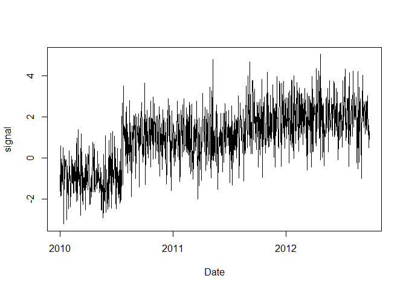
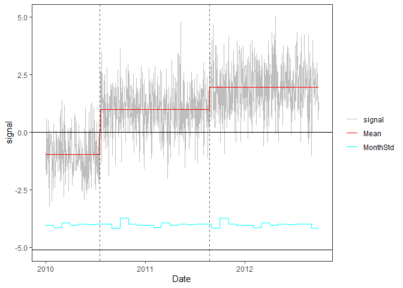

<!-- Example1.md is generated from Example1.Rmd. Please edit that file -->

## Example 1

### 1. Simulate a time series with 2 change-points

    rm(list=ls(all=TRUE))
    library(PMLseg)

    # time series simulation function
    # Note: by convention the position of a change-point is the last point in the segment
    simulate_time_series <- function(cp_ind, segmt_mean, noise_stdev, length_series) {
      time_series <- rep(0, length_series)
      jump_indices <- c(1, cp_ind+1, length_series + 1)
      offsets <- c(0, diff(segmt_mean))

      changes <- rep(0, length_series)
      changes[jump_indices[-length(jump_indices)]] <- offsets
      changes[1] <- segmt_mean[1]

      time_series <- cumsum(changes)
      noise <- rnorm(n = length_series, mean = 0, sd = noise_stdev)
      time_series <- time_series + noise

      return(time_series)
    }

    # specify the simulation parameters
    n = 1000                    # length of time series
    cp_ind <- c(200, 600)       # position of change points (index in time series)
    segmt_mean <- c(-1, 1, 2)   # mean value of segments
    noise_stdev = 1             # noise std dev (identical for all months)
    set.seed(1)                 # initialise random generator

    # create a data frame of time series with 2 columns: date, signal
    mydate <- seq.Date(from = as.Date("2010-01-01"), to = as.Date("2010-01-01")+(n-1), by = "day")
    mysignal <- simulate_time_series(cp_ind, segmt_mean, noise_stdev, n)
    df = data.frame(date = mydate, signal = mysignal)
    plot(df$date, df$signal, type = "l",xlab ="Date",ylab="signal")

    head(df, 3)
    #>         date     signal
    #> 1 2010-01-01 -1.6264538
    #> 2 2010-01-02 -0.8163567
    #> 3 2010-01-03 -1.8356286

### 2. Segmentation

Run the segmentation with default parameters and no functional:

    seg = Segmentation(OneSeries = df, 
                       FunctPart = FALSE)
    str(seg)
    #> List of 5
    #>  $ Tmu     :'data.frame':    3 obs. of  5 variables:
    #>   ..$ begin: int [1:3] 1 201 601
    #>   ..$ end  : int [1:3] 200 600 1000
    #>   ..$ mean : num [1:3] -0.959 0.999 1.97
    #>   ..$ se   : num [1:3] 0.075 0.0538 0.053
    #>   ..$ np   : int [1:3] 200 400 400
    #>  $ FitF    : logi FALSE
    #>  $ CoeffF  : logi FALSE
    #>  $ MonthVar: num [1:12] 1.089 0.887 1.334 1.092 1.21 ...
    #>  $ SSR     : num 926

The `Tmu` dataframe contains, for each segment: the index of beginning
and end, the esitmated mean and its standard erreor `se`, and the number
of valid (non-NA) data points `np` in the signal:

    seg$Tmu
    #>   begin  end       mean         se  np
    #> 1     1  200 -0.9590041 0.07503988 200
    #> 2   201  600  0.9986774 0.05381478 400
    #> 3   601 1000  1.9700134 0.05301899 400

### 3. Visualization of the time series with segmentation results superposed

    PlotSeg(OneSeries = df, 
            SegRes = seg, 
            FunctPart = FALSE)

The plot shows the signal (grey line), the estimated means (red line),
the estimated noise std (cyan line). Note that the y-intercept of the
noise is the lower black line. Dashed vertical lines show the estimated
times of the change-points.

### 4. Validation of detected change-points with metadata

Metadata is represented by a data frame with 2 columns: `date`, `type`.

For the example, we create a fake metadata data frame with the true
position of change-points:

    meta_ind = cp_ind               # index in time series of metadata information
    meta_date <- df$date[meta_ind]  # corresponding date 
    meta_type <- c("R", "RAD")      # type of information, e.g. R = receiver change, A = antenna change, D = radome change
    metadata = data.frame(date = meta_date, type = meta_type)
    metadata
    #>         date type
    #> 1 2010-07-19    R
    #> 2 2011-08-23  RAD

Plot with metadata:

    PlotSeg(OneSeries = df, 
            SegRes = seg, 
            FunctPart = FALSE, 
            Metadata = metadata) 

Validate estimated change-point positions wrt metadata:

    valid_max_dist = 62             # maximum distance wrt metadata for a CP to be validated
    valid = Validation(OneSeries = df, 
               Tmu = seg$Tmu,
               MaxDist =  valid_max_dist,
               Metadata = metadata)
    valid
    #> # A tibble: 2 × 5
    #>   CP         closestMetadata Distance type  valid
    #>   <date>     <date>             <dbl> <chr> <dbl>
    #> 1 2010-07-19 2010-07-19             0 R         1
    #> 2 2011-08-23 2011-08-23             0 RAD       1

Plot with metadata and validation results:

    PlotSeg(OneSeries = df, SegRes = seg, FunctPart = FALSE, Metadata = metadata, Validated_CP_Meta = valid)

Validated change-points are inducated by a filled triangle at the bottom
line.
