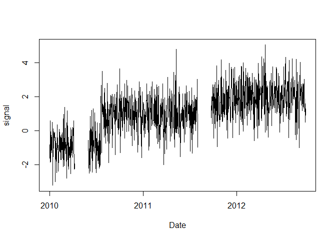
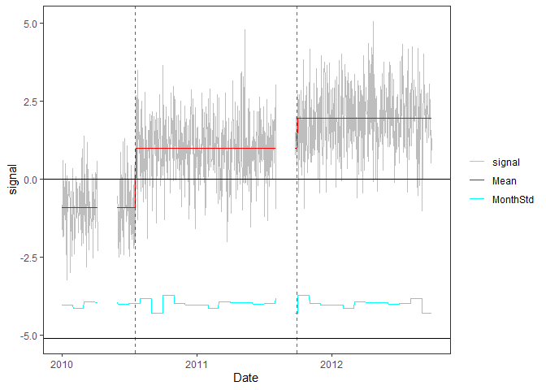
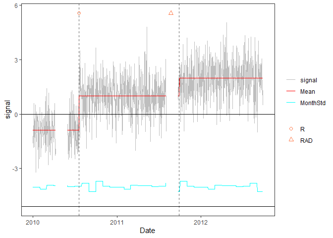
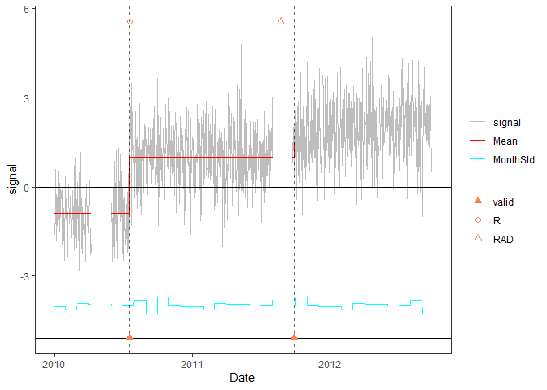

<!-- Example2.md is generated from Example2.Rmd. Please edit that file -->

## Example 2 : time series with missing data

### 1. Simulate a time series with NA values

    rm(list=ls(all=TRUE))
    library(PMLseg)

    # time series simulation function
    # Note: by convention the position of a change-point is the last point in the segment
    simulate_time_series <- function(cp_ind, segmt_mean, noise_stdev, length_series) {
      time_series <- rep(0, length_series)
      jump_indices <- c(1, cp_ind+1, length_series + 1)
      offsets <- c(0, diff(segmt_mean))

      changes <- rep(0, length_series)
      changes[jump_indices[-length(jump_indices)]] <- offsets
      changes[1] <- segmt_mean[1]

      time_series <- cumsum(changes)
      noise <- rnorm(n = length_series, mean = 0, sd = noise_stdev)
      time_series <- time_series + noise

      return(time_series)
    }

    # specify the simulation parameters
    n = 1000                    # length of time series
    cp_ind <- c(200, 600)       # position of change points (index in time series)
    segmt_mean <- c(-1, 1, 2)   # mean value of segments
    noise_stdev = 1             # noise std dev (identical for all months)
    set.seed(1)                 # initialise random generator

    # create a data frame of time series with 2 columns: date, signal
    mydate <- seq.Date(from = as.Date("2010-01-01"), to = as.Date("2010-01-01")+(n-1), by = "day")
    mysignal <- simulate_time_series(cp_ind, segmt_mean, noise_stdev, n)

    # add NA's in the signal
    NA_ind = seq(from = 100, to = 150, by = 1)  # gap in the 1st segment
    mysignal[NA_ind] <- NA
    NA_ind = seq(from = 580, to = 630, by = 1) # gap in the 2nd segment, superposed with 2nd change-point
    mysignal[NA_ind] <- NA

    # plot signal
    df = data.frame(date = mydate, signal = mysignal)
    plot(df$date, df$signal, type = "l",xlab ="Date",ylab="signal")

### 2. Segmentation

Run the segmentation with default parameters and no functional:

    seg = Segmentation(OneSeries = df, 
                       FunctPart = FALSE)
    seg$Tmu
    #>   begin  end       mean         se  np
    #> 1     1  200 -0.8974084 0.08695923 149
    #> 2   201  636  1.0046283 0.05436229 385
    #> 3   637 1000  1.9698991 0.05627932 364

### 3. Visualization of the time series with segmentation results superposed

    PlotSeg(OneSeries = df, 
            SegRes = seg, 
            FunctPart = FALSE)

### 4. Validation of detected change-points with metadata

For the example, we create a fake metadata data frame with the true
position of change-points:

    meta_ind = cp_ind               # index in time series of metadata information
    meta_date <- df$date[meta_ind]  # corresponding date 
    meta_type <- c("R", "RAD")      # type of information, e.g. R = receiver change, A = antenna change, D = radome change
    metadata = data.frame(date = meta_date, type = meta_type)
    metadata
    #>         date type
    #> 1 2010-07-19    R
    #> 2 2011-08-23  RAD

Plot with metadata:

    PlotSeg(OneSeries = df, 
            SegRes = seg, 
            FunctPart = FALSE, 
            Metadata = metadata) 

Validate estimated change-point positions wrt metadata:

    valid_max_dist = 62             # maximum distance wrt metadata for a CP to be validated
    valid = Validation(OneSeries = df, 
               Tmu = seg$Tmu,
               MaxDist =  valid_max_dist,
               Metadata = metadata)
    valid
    #> # A tibble: 2 × 5
    #>   CP         closestMetadata Distance type  valid
    #>   <date>     <date>             <dbl> <chr> <dbl>
    #> 1 2010-07-19 2010-07-19             0 R         1
    #> 2 2011-09-28 2011-08-23             5 RAD       1

Plot with metadata and validation results:

    PlotSeg(OneSeries = df, SegRes = seg, FunctPart = FALSE, Metadata = metadata, Validated_CP_Meta = valid)

