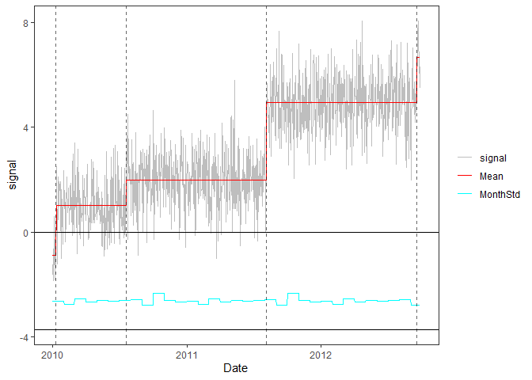

<!-- Example3.md is generated from Example3.Rmd. Please edit that file -->

## Example 3: time series with clusters of CPs

It can happen with real data that several CPs occur in a short period of
time, either real or due to noise spikes. Despite the penalization, the
segmentation can sometimes add unwanted changepoints. We included a
screening function to remove cluster of close CPs.

### 1. Simulate a time series with 2 clusters

    rm(list=ls(all=TRUE))
    library(PMLseg)

    # time series simulation function
    # Note: by convention the position of a change-point is the last point in the segment
    simulate_time_series <- function(cp_ind, segmt_mean, noise_stdev, length_series) {
      time_series <- rep(0, length_series)
      jump_indices <- c(1, cp_ind+1, length_series + 1)
      offsets <- c(0, diff(segmt_mean))

      changes <- rep(0, length_series)
      changes[jump_indices[-length(jump_indices)]] <- offsets
      changes[1] <- segmt_mean[1]

      time_series <- cumsum(changes)
      noise <- rnorm(n = length_series, mean = 0, sd = noise_stdev)
      time_series <- time_series + noise

      return(time_series)
    }

    # specify the simulation parameters
    n = 1000                                       # length of time series
    cp_ind <- c(10, 200, 210, 580, 590, 600, 990)  # 2 clusters of CPs + one short segment at the begining and one at the end => 7 CPs
    segmt_mean <- c(0, -1, 5, 1, -5, 5, 2, 0)      # mean of segments
    noise_stdev = 1                                # noise std dev (identical for all months)
    set.seed(1)                                    # initialise random generator

    # create a data frame of time series with 2 columns: date, signal
    mydate <- seq.Date(from = as.Date("2010-01-01"), to = as.Date("2010-01-01")+(n-1), by = "day")
    mysignal <- simulate_time_series(cp_ind, segmt_mean, noise_stdev, n)
    df = data.frame(date = mydate, signal = mysignal)
    plot(df$date, df$signal, type = "l",xlab ="Date",ylab="signal")
    abline(v = mydate[cp_ind], col = "red", lty = 2)

### 2. Segmentation

Run the segmentation with default parameters and no functional:

    seg = Segmentation(OneSeries = df, 
                       FunctPart = FALSE)
    str(seg)
    #> List of 5
    #>  $ Tmu     :'data.frame':    8 obs. of  5 variables:
    #>   ..$ begin: int [1:8] 1 12 201 211 581 591 601 991
    #>   ..$ end  : int [1:8] 11 200 210 580 590 600 990 1000
    #>   ..$ mean : num [1:8] 0.167 -0.971 5.527 0.986 -4.664 ...
    #>   ..$ se   : num [1:8] 0.3111 0.0774 0.3594 0.0563 0.3837 ...
    #>   ..$ np   : int [1:8] 11 189 10 370 10 10 390 10
    #>  $ FitF    : logi FALSE
    #>  $ CoeffF  : logi FALSE
    #>  $ MonthVar: num [1:12] 1.065 0.887 1.334 1.092 1.21 ...
    #>  $ SSR     : num 901

    seg$Tmu
    #>   begin  end       mean         se  np
    #> 1     1   11  0.1667099 0.31114798  11
    #> 2    12  200 -0.9713045 0.07737888 189
    #> 3   201  210  5.5271484 0.35944691  10
    #> 4   211  580  0.9858219 0.05634461 370
    #> 5   581  590 -4.6640059 0.38365696  10
    #> 6   591  600  4.7472015 0.38365696  10
    #> 7   601  990  1.9793571 0.05450709 390
    #> 8   991 1000 -0.3262317 0.29314546  10

### 3. Visualization of the time series with segmentation results superposed

    PlotSeg(OneSeries = df, 
            SegRes = seg, 
            FunctPart = FALSE)

### 4. Cluster screening

cluster\_max\_dist = 80 \# max distance between CPs in a cluster
screening = Cluster\_screening(Tmu = seg$Tmu, MaxDist =
cluster\_max\_dist) screening

# update the segmentation parameters

seg\_updated = UpdatedParametersForFixedCP(OneSeries = df, ResScreening
= screening, FunctPart=FALSE) seg\_updated

# Plot the time series with RemoveData option

PlotSeg(OneSeries = df, SegRes = seg\_updated, FunctPart = FALSE,
RemoveData = screening$RemoveData)
