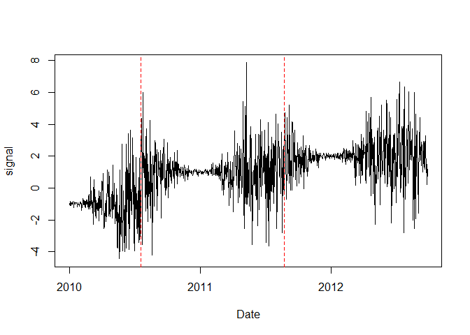

<!-- Example4.md is generated from Example4.Rmd. Please edit that file -->

## Example 4: time series with monthly varying variance

### 1. Simulate a time series with one different variance every calendar month

    rm(list=ls(all=TRUE))
    library(PMLseg)

    # time series simulation function
    # Note: by convention the position of a change-point is the last point in the segment
    simulate_time_series <- function(cp_ind, segmt_mean, noise_stdev, length_series) {
      time_series <- rep(0, length_series)
      jump_indices <- c(1, cp_ind+1, length_series + 1)
      offsets <- c(0, diff(segmt_mean))

      changes <- rep(0, length_series)
      changes[jump_indices[-length(jump_indices)]] <- offsets
      changes[1] <- segmt_mean[1]
      time_series <- cumsum(changes)

      noise <- rnorm(n = length_series, mean = 0, sd = 1)
      sd = noise_stdev[as.numeric(format(mydate, "%m"))]
      time_series <- time_series + noise * sd

      return(time_series)
    }

    # specify the simulation parameters
    n = 1000                            # length of time series
    cp_ind <- c(200, 600)               # position of change points (index in time series)
    segmt_mean <- c(-1, 1, 2)           # mean value of segments
    noise_stdev <- c(0.1, 0.3, 0.7, 1.2, 1.8, 2, 2, 1.8, 1.2, 0.7, 0.3, 0.1) # 12 values, one per month (Jan to Dec)
    set.seed(1)                         # initialise random generator

    # create a data frame of time series with 2 columns: date, signal
    mydate <- seq.Date(from = as.Date("2010-01-01"), to = as.Date("2010-01-01")+(n-1), by = "day")
    mysignal <- simulate_time_series(cp_ind, segmt_mean, noise_stdev, n)
    df = data.frame(date = mydate, signal = mysignal)
    plot(df$date, df$signal, type = "l",xlab ="Date",ylab="signal")
    abline(v = mydate[cp_ind], col = "red", lty = 2)

### 2. Segmentation

Run the segmentation with default parameters:

    seg = Segmentation(OneSeries = df, 
                       FunctPart = FALSE)
    str(seg)
    #> List of 5
    #>  $ Tmu     :'data.frame':    3 obs. of  5 variables:
    #>   ..$ begin: int [1:3] 1 201 602
    #>   ..$ end  : int [1:3] 200 601 1000
    #>   ..$ mean : num [1:3] -0.985 1 1.995
    #>   ..$ se   : num [1:3] 0.0175 0.0125 0.0124
    #>   ..$ np   : int [1:3] 200 401 399
    #>  $ FitF    : logi FALSE
    #>  $ CoeffF  : logi FALSE
    #>  $ MonthVar: num [1:12] 0.0109 0.0798 0.6539 1.5729 3.92 ...
    #>  $ SSR     : num 930

    seg$Tmu
    #>   begin  end       mean         se  np
    #> 1     1  200 -0.9851706 0.01745298 200
    #> 2   201  601  0.9995062 0.01246875 401
    #> 3   602 1000  1.9948656 0.01244232 399

### 3. Visualization of the time series with segmentation results superposed

    PlotSeg(OneSeries = df, 
            SegRes = seg, 
            FunctPart = FALSE)

Note: the segmentation works well despite the steep variations in the
noise variance

### Compare estimated noise variance vs truth

    seg$MonthVar - noise_stdev ** 2
    #>  [1]  0.0008875807 -0.0101890032  0.1638940441  0.1328782098  0.6799585110
    #>  [6]  0.6809336179  0.7337017734  0.7244649334 -0.2390260031  0.4285360695
    #> [11]  0.0213824862  0.0010628167
    sd(seg$MonthVar - noise_stdev ^ 2)^2
    #> [1] 0.1233949

Note: increasing the length of the time series (more years) would
improve the accuracy of the noise variance estimation
