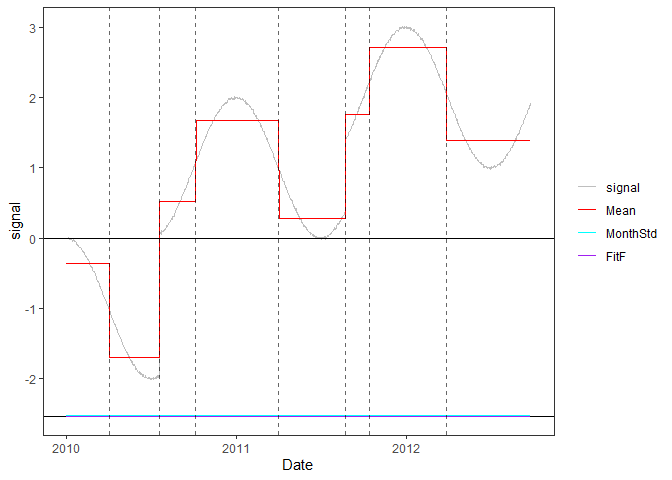
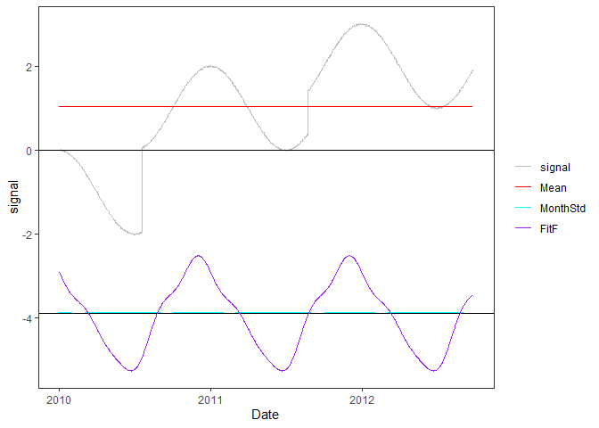
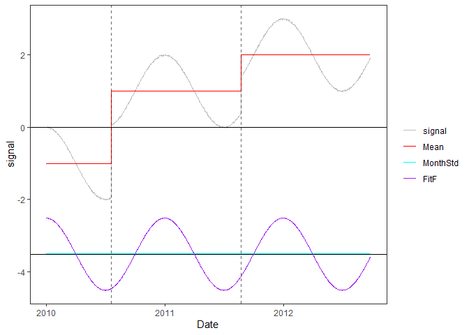

<!-- Example5.md is generated from Example5.Rmd. Please edit that file -->

## Example 5: time series with periodic bias

### 1. Simulate a time series with periodic bias and constant noise variance

    rm(list=ls(all=TRUE))
    library(PMLseg)

    # define simulation function
    simulate_time_series <- function(cp_ind, segmt_mean, noise_stdev, length_series) {
      time_series <- rep(0, length_series)
      jump_indices <- c(1, cp_ind+1, length_series + 1)
      offsets <- c(0, diff(segmt_mean))

      changes <- rep(0, length_series)
      changes[jump_indices[-length(jump_indices)]] <- offsets
      changes[1] <- segmt_mean[1]
      time_series <- cumsum(changes)

      noise <- rnorm(n = length_series, mean = 0, sd = 1)
      sd = noise_stdev[as.numeric(format(mydate, "%m"))]
      time_series <- time_series + noise * sd

      return(time_series)
    }

    # specify the simulation parameters
    date_begin <- as.Date("2010-03-01") # date of first data point
    n = 1000                            # length of time series
    cp_ind <- c(200, 600)               # position of change points (index in time series)
    segmt_mean <- c(-1, 1, 2)           # mean value of segments
    noise_stdev <- rep(0.01, 12)         # noise variance (Jan to Dec)
    coeff <- c(1, 0, 0, 0)              # Fourier Series coefficients (cos1, sin1, cos2, sin2...) up to order 4
    set.seed(1)

    # create a time series df with jumps and noise
    mydate <- seq.Date(from = date_begin, to = date_begin + n - 1, by = "day")
    mysignal <- simulate_time_series(cp_ind, segmt_mean, noise_stdev, n)

    # create a periodic function (Fourier series)
    T = 365.25                             # reference period (unit days)
    t = as.numeric(mydate)                 # time variable for periodic function
    t0 = as.numeric(mydate[1])             # reference date of periodic function is first date of time series
    p = length(coeff) / 2                  # order of Fourier Series
    f = rowSums(sapply(1:p, function(i) coeff[2*i-1]*cos(i*(t-t0+1)*(2*pi)/T) + coeff[2*i]*sin(i*(t-t0+1)*(2*pi)/T)))

    # add periodic function to the signal
    mysignal <- mysignal + f
    df = data.frame(date = mydate, signal = mysignal)

    # plot signal and position of change-points (red dashed line)
    plot(df$date, df$signal, type = "l",xlab ="Date",ylab="signal")
    abline(v = mydate[cp_ind], col = "red", lty = 2)

### 2. Segmentation

Run segmentation without functional part

    seg_nofunc = Segmentation(OneSeries = df, FunctPart = FALSE)
    seg_nofunc$Tmu
    #>   begin  end       mean           se  np
    #> 1     1   93 -0.3627934 0.0010552088  93
    #> 2    94  200 -1.7003666 0.0010310747 107
    #> 3   201  279  0.5281697 0.0011635186  79
    #> 4   280  457  1.6779627 0.0008067055 178
    #> 5   458  600  0.2804752 0.0009024617 143
    #> 6   601  652  1.7650078 0.0014112437  52
    #> 7   653  818  2.7073268 0.0008274824 166
    #> 8   819 1000  1.3858510 0.0007815470 182
    PlotSeg(OneSeries = df, SegRes = seg_nofunc, FunctPart = TRUE)

Run segmentation with functional

    seg = Segmentation(OneSeries = df, FunctPart = TRUE)
    seg$Tmu
    #>   begin  end     mean           se   np
    #> 1     1 1000 1.039937 0.0003344206 1000
    seg$CoeffF
    #>        cos1        sin1        cos2        sin2        cos3        sin3 
    #>  1.07687320 -0.54811564 -0.11924598 -0.02428370  0.07353371 -0.10516369 
    #>        cos4        sin4 
    #> -0.05989012 -0.07936323
    seg$MonthVar
    #>  [1] 1.135745e-04 1.200317e-04 1.050613e-04 9.107146e-05 1.170711e-04
    #>  [6] 1.133393e-04 1.040371e-04 1.240750e-04 1.168365e-04 1.324408e-04
    #> [11] 8.244631e-05 1.913020e-04
    seg$SSR
    #> [1] 9486418
    sum(seg$CoeffF^2)
    #> [1] 1.501248
    PlotSeg(OneSeries = df, SegRes = seg, FunctPart = TRUE)

Run segmentation with functional and selection of statistically
significant coefficients

    seg = Segmentation(OneSeries = df, FunctPart = TRUE, selectionF = TRUE)
    seg$Tmu
    #>   begin  end       mean           se  np
    #> 1     1  200 -0.9996940 0.0007374646 200
    #> 2   201  600  0.9999809 0.0005342822 400
    #> 3   601 1000  1.9996727 0.0005270684 400
    seg$CoeffF
    #>        cos1        sin1 
    #>  0.99993288 -0.01712633
    seg$MonthVar
    #>  [1] 1.135745e-04 1.200317e-04 1.050613e-04 9.107146e-05 1.170711e-04
    #>  [6] 1.133393e-04 1.040371e-04 1.240750e-04 1.168365e-04 1.324408e-04
    #> [11] 8.244631e-05 1.913020e-04
    seg$SSR
    #> [1] 940.7796
    sum(seg$CoeffF^2)
    #> [1] 1.000159
    PlotSeg(OneSeries = df, SegRes = seg, FunctPart = TRUE)

