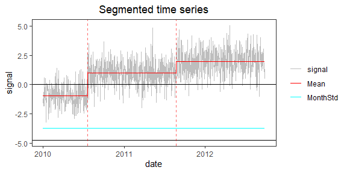
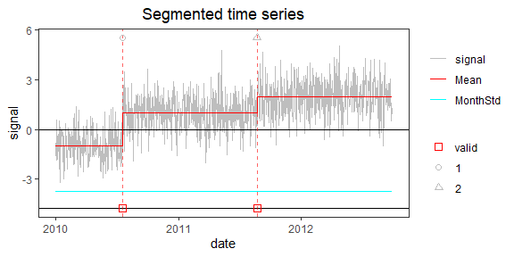

<!-- Example1.md is generated from Example1.Rmd. Please edit that file -->

## Example 1: time series with 2 change-points and constant noise

### 1. Simulate a time series

    rm(list=ls(all=TRUE))
    library(PMLseg)

    # Note 1: Note: by convention the date/time of a change-point is the date/time of the last point in the segment

    # define simulation function
    simulate_time_series <- function(cp_ind, segmt_mean, noise_stdev, length_series) {
      time_series <- rep(0, length_series)
      jump_indices <- c(1, cp_ind+1, length_series + 1)
      offsets <- c(0, diff(segmt_mean))

      changes <- rep(0, length_series)
      changes[jump_indices[-length(jump_indices)]] <- offsets
      changes[1] <- segmt_mean[1]

      time_series <- cumsum(changes)
      noise <- rnorm(n = length_series, mean = 0, sd = noise_stdev)
      time_series <- time_series + noise

      return(time_series)
    }

    # specify the simulation parameters
    n <- 1000                   # length of time series
    cp_ind <- c(200, 600)       # position of CPs (index in time series)
    segmt_mean <- c(-1, 1, 2)   # mean value of segments
    noise_stdev <- 1            # noise std dev
    set.seed(1)                 # initialise random generator

    # create a data frame of time series with 2 columns: date, signal
    mydate <- seq.Date(from = as.Date("2010-01-01"), to = as.Date("2010-01-01")+(n-1), by = "day")
    mysignal <- simulate_time_series(cp_ind, segmt_mean, noise_stdev, n)
    OneSeries <- data.frame(date = mydate, signal = mysignal)

    # plot signal and position of change-points (red dashed line)
    plot(OneSeries$date, OneSeries$signal, type = "l", col = "gray", xlab = "date", ylab = "signal", main="Simulated time series")
    abline(v = mydate[cp_ind], col = "red", lty = 2)

### 2. Segmentation

Run the segmentation with without functional and `VarMonthly=TRUE`:

    seg = Segmentation(OneSeries = OneSeries, 
                       FunctPart = FALSE,
                       VarMonthly = TRUE)
    str(seg)
    #> List of 6
    #>  $ Tmu     :'data.frame':    3 obs. of  7 variables:
    #>   ..$ begin : int [1:3] 1 201 601
    #>   ..$ end   : int [1:3] 200 600 1000
    #>   ..$ tbegin: Date[1:3], format: "2010-01-01" "2010-07-20" ...
    #>   ..$ tend  : Date[1:3], format: "2010-07-19" "2011-08-23" ...
    #>   ..$ mean  : num [1:3] -0.959 0.999 1.97
    #>   ..$ se    : num [1:3] 0.075 0.0538 0.053
    #>   ..$ np    : int [1:3] 200 400 400
    #>  $ FitF    : logi FALSE
    #>  $ CoeffF  : logi FALSE
    #>  $ MonthVar: num [1:12] 1.089 0.887 1.334 1.092 1.21 ...
    #>  $ SSR     : num 926
    #>  $ SSR_All : num [1:30] 1943 1092 926 923 914 ...

`Tmu` is a list which contains, for each segment: the index and date of
beginning and end, the estimated mean and its standard erreor, and the
number of valid data points (non-NA values in the signal):

    print(seg$Tmu)
    #>   begin  end     tbegin       tend       mean         se  np
    #> 1     1  200 2010-01-01 2010-07-19 -0.9590041 0.07503988 200
    #> 2   201  600 2010-07-20 2011-08-23  0.9986774 0.05381478 400
    #> 3   601 1000 2011-08-24 2012-09-26  1.9700134 0.05301899 400

### 3. Visualization of the time series with segmentation results superposed

    PlotSeg(OneSeries = OneSeries, 
            SegRes = seg, 
            FunctPart = FALSE)

The plot shows the signal (grey line), the estimated means (red line),
the estimated noise std (cyan line). The y-intercept of the noise is the
lower black line. Dashed vertical lines show the estimated times of the
change-points.

### 4. Validation of detected change-points with metadata

Metadata is represented by a data frame with 2 columns: `date`, `type`.

For the example, we create a fake metadata data frame with the true
dates of CPs

    Metadata = data.frame(date = OneSeries$date[cp_ind], type = c("1", "2"))
    print(Metadata)
    #>         date type
    #> 1 2010-07-19    1
    #> 2 2011-08-23    2

Plot with metadata:

    PlotSeg(OneSeries = OneSeries, 
            SegRes = seg, 
            FunctPart = FALSE, 
            Metadata = Metadata) 

Validate estimated change-point positions wrt metadata with a maximum
distance of 10 days:

    valid = Validation(OneSeries = OneSeries, 
               Tmu = seg$Tmu,
               MaxDist =  10,
               Metadata = Metadata)
    valid
    #>           CP closestMetadata type Distance valid
    #> 1 2010-07-19      2010-07-19    1        0     1
    #> 2 2011-08-23      2011-08-23    2        0     1

Note: `valid$Distance` gives the distance between estimated CP and
metadata

Plot with metadata and validation results:

    PlotSeg(OneSeries = OneSeries, SegRes = seg, FunctPart = FALSE, Metadata = Metadata, Validated_CP_Meta = valid)

Validated change-points are indicated by the red squares at the bottom
line.

### 5. Further explore the sensitivity of segmentation results to signal and noise parameters

#### Impact of sample size on estimated parameters

1.  run again with `n = 4000` and observe that:

-   the position of change-points is the same as with `n = 1000`
-   the `seg$Tmu$mean` value the last segment (longer than with
    `n = 1000`) is more accurate and `seg$Tmu$se` is smaller
-   the `seg$MonthVar` values are closer to the true value (1)

1.  run again with `n = 500`

#### Impact of signal to noise ratio on estimated parameters

1.  run again with `noise_std = 0.1` and observe that the the
    `seg$Tmu$mean` and `seg$MonthVar` estimates are more precise.

2.  run again with `noise_std = 10` and observe the opposite.
