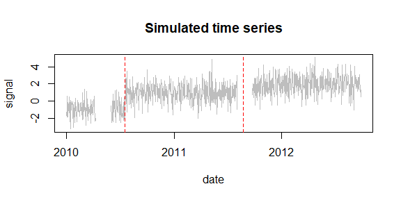
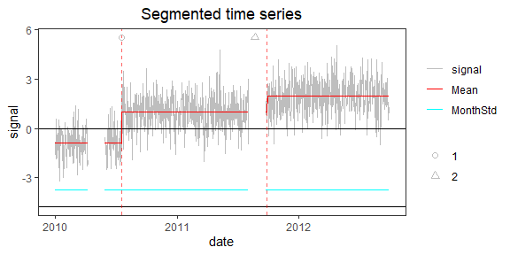
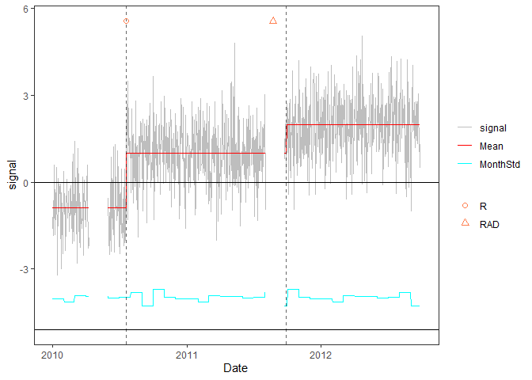

<!-- Example2.md is generated from Example2.Rmd. Please edit that file -->

## Example 2: time series with missing data

### 1. Simulate time series

    rm(list=ls(all=TRUE))
    library(PMLseg)

    # define simulation function
    simulate_time_series <- function(cp_ind, segmt_mean, noise_stdev, length_series) {
      time_series <- rep(0, length_series)
      jump_indices <- c(1, cp_ind+1, length_series + 1)
      offsets <- c(0, diff(segmt_mean))

      changes <- rep(0, length_series)
      changes[jump_indices[-length(jump_indices)]] <- offsets
      changes[1] <- segmt_mean[1]

      time_series <- cumsum(changes)
      noise <- rnorm(n = length_series, mean = 0, sd = noise_stdev)
      time_series <- time_series + noise

      return(time_series)
    }

    # specify the simulation parameters
    n <- 1000                    # length of time series
    cp_ind <- c(200, 600)        # position of change points (index in time series)
    segmt_mean <- c(-1, 1, 2)    # mean value of segments
    noise_stdev <- 1             # noise std dev (identical for all months)
    set.seed(1)                  # initialise random generator

    # simulate data
    mydate <- seq.Date(from = as.Date("2010-01-01"), to = as.Date("2010-01-01")+(n-1), by = "day")
    mysignal <- simulate_time_series(cp_ind, segmt_mean, noise_stdev, n)

    # true CP date
    CP_date <- mydate[cp_ind]                             # date of CP
    CP_date
    #> [1] "2010-07-19" "2011-08-23"

    # define fake metadata from true CP dates
    meta_date <- CP_date                                  # date of metadata event = date of CP
    meta_type <- c("receiver_change", "antenna_change")   # type of metadata event
    metadata = data.frame(date = meta_date, type = meta_type)

    # add NA's in the signal
    NA_ind <- seq(from = 100, to = 150, by = 1)  # 1st gap
    mysignal[NA_ind] <- NA
    NA_ind <- seq(from = 580, to = 630, by = 1)  # 2nd gap 
    mysignal[NA_ind] <- NA

    # create a time series df
    df <- data.frame(date = mydate, signal = mysignal)

    # plot signal and position of change-points (red dashed line)
    plot(df$date, df$signal, type = "l", col = "gray", xlab = "date", ylab = "signal", main="Simulated time series")
    abline(v = CP_date, col = "red", lty = 2)

Note that the 1st gap lies within the 1st segment, while the 2nd gap is
overlapping the 2nd change-point.

### 2. Segmentation

Run the segmentation without the functional part:

    seg = Segmentation(OneSeries = df, 
                       FunctPart = FALSE)
    seg$Tmu
    #>   begin  end       mean         se  np
    #> 1     1  200 -0.8974084 0.08695923 149
    #> 2   201  636  1.0046283 0.05436229 385
    #> 3   637 1000  1.9698991 0.05627932 364

The first CP is detected at the right date but not the 2nd one because
of the gap. However the missing data points do not count in `np`. Hence,
the gap does not hamper the validation (see below).

### 3. Visualization of the time series with segmentation results and metadata superposed

Plot with metadata:

    PlotSeg(OneSeries = df, 
            SegRes = seg, 
            FunctPart = FALSE, 
            Metadata = metadata) 

### 4. Validation of detected change-points with metadata

    valid_max_dist = 10             # maximum distance wrt metadata for a CP to be validated
    valid = Validation(OneSeries = df, 
               Tmu = seg$Tmu,
               MaxDist =  valid_max_dist,
               Metadata = metadata)
    valid
    #> # A tibble: 2 × 5
    #>   CP         closestMetadata Distance type            valid
    #>   <date>     <date>             <dbl> <chr>           <dbl>
    #> 1 2010-07-19 2010-07-19             0 receiver_change     1
    #> 2 2011-09-28 2011-08-23             5 antenna_change      1

Note that the distance between the 2nd CP (index=636) and the nearest
metadata (index=600) excludes the NA values (up to 630): 636 - 631 = 5.

Hence both CPs are validated.

    PlotSeg(OneSeries = df, SegRes = seg, FunctPart = FALSE, Metadata = metadata, Validated_CP_Meta = valid)

