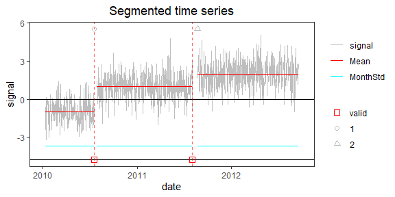

<!-- Example3.md is generated from Example3.Rmd. Please edit that file -->

## Example 3: time series with clusters of CPs

In real data, clusters of CPs can occur in a short period of time or can
be due to noise spikes. In many applications, we don’t want to keep such
clusters with short segments. We have included a screening function
which removes clusters or reduces them to single CPs, depending on the
significance of the change in mean before/after each cluster. If the
change is significant the cluster is replaced by a single CP, otherwise
all the CPs in that cluster are removed.

### 1. Simulate a time series with 2 clusters

    rm(list=ls(all=TRUE))
    library(PMLseg)

    # define simulation function
    simulate_time_series <- function(cp_ind, segmt_mean, noise_stdev, length_series) {
      time_series <- rep(0, length_series)
      jump_indices <- c(1, cp_ind+1, length_series + 1)
      offsets <- c(0, diff(segmt_mean))

      changes <- rep(0, length_series)
      changes[jump_indices[-length(jump_indices)]] <- offsets
      changes[1] <- segmt_mean[1]

      time_series <- cumsum(changes)
      noise <- rnorm(n = length_series, mean = 0, sd = noise_stdev)
      time_series <- time_series + noise

      return(time_series)
    }

    # specify the simulation parameters
    n <- 1000                                       # length of time series
    cp_ind <- c(10, 200, 210, 580, 590, 600, 990)   # 2 clusters of CPs + one short segment at the begining and one at the end
    segmt_mean <- c(0, -1, 5, 1, -5, 5, 2, 0)       # mean of segments
    noise_stdev <- 1                                # noise std dev (identical for all months)
    set.seed(1)                                     # initialise random generator

    # create a data frame of time series with 2 columns: date, signal
    mydate <- seq.Date(from = as.Date("2010-01-01"), to = as.Date("2010-01-01")+(n-1), by = "day")
    mysignal <- simulate_time_series(cp_ind, segmt_mean, noise_stdev, n)
    OneSeries <- data.frame(date = mydate, signal = mysignal)

    CP_date <- mydate[cp_ind]                       # dates of CP

    # plot signal and position of change-points
    plot(OneSeries$date, OneSeries$signal, type = "l", col = "gray", xlab = "date", ylab = "signal", main="Simulated time series")
    abline(v = CP_date, col = "red", lty = 2)

### 2. Segmentation

Run the segmentation without the functional part:

    SegRes = Segmentation(OneSeries = OneSeries, 
                       FunctPart = FALSE,
                       VarMonthly = FALSE)

    print(SegRes$Tmu)
    #>   begin  end     tbegin       tend       mean         se  np
    #> 1     1   11 2010-01-01 2010-01-11  0.1667099 0.32492519  11
    #> 2    12  200 2010-01-12 2010-07-19 -0.9773856 0.07838786 189
    #> 3   201  210 2010-07-20 2010-07-29  5.5271484 0.34078441  10
    #> 4   211  580 2010-07-30 2011-08-03  0.9828615 0.05602461 370
    #> 5   581  590 2011-08-04 2011-08-13 -4.6640059 0.34078441  10
    #> 6   591  600 2011-08-14 2011-08-23  4.7472015 0.34078441  10
    #> 7   601  990 2011-08-24 2012-09-16  1.9608822 0.05456918 390
    #> 8   991 1000 2012-09-17 2012-09-26 -0.3262317 0.34078441  10

### 3. Visualization of the time series with segmentation results superposed

    PlotSeg(OneSeries = OneSeries, 
            SegRes = SegRes, 
            FunctPart = FALSE)

Note that the segmentation is able to detect all CPs, even those close
to the beginning and end of the time series.

### 4. Cluster screening

We want to remove the segments smaller than 80 days, either isolated or
in clusters.

    screening <- Cluster_screening(Tmu = SegRes$Tmu, MaxDist = 80)
    screening
    #> $UpdatedCP
    #> [1] 200 580
    #> 
    #> $RemoveData
    #>   begin  end
    #> 1     1   11
    #> 2   201  210
    #> 3   581  600
    #> 4   991 1000
    #> 
    #> $ChangeCP
    #> [1] "Yes"

The Cluster\_screening function returns information to update the
segmentation dataframe.

Now, update the segmentation parameters and the time serie

    SegResUpd <- UpdatedParametersForFixedCP(OneSeries = OneSeries, ResScreening = screening, FunctPart=FALSE, VarMonthly=FALSE)
    print(SegResUpd)
    #> $MonthVar
    #> [1] 1.155089
    #> 
    #> $Tmu
    #>   begin  end     tbegin       tend       mean         se  np
    #> 1     1  200 2010-01-01 2010-07-19 -0.9773856 0.07817659 189
    #> 2   201  580 2010-07-20 2011-08-03  0.9828615 0.05587362 370
    #> 3   581 1000 2011-08-04 2012-09-26  1.9608822 0.05442211 390
    #> 
    #> $FitF
    #> [1] FALSE
    #> 
    #> $CoeffF
    #> [1] FALSE
    #> 
    #> $SSR
    #> [1] 881.1525

    OneSeriesUpd <- UpdateTimeSeries(OneSeries, screening$RemoveData)

Plot the updated time series with the updated segmentation information.

    PlotSeg(OneSeries = OneSeriesUpd, SegRes = SegResUpd, FunctPart = FALSE)

### 5. Validation of change-points after screening

    Metadata = data.frame(date = CP_date[c(2, 6)], type = c("1", "2"))
    valid = Validation(OneSeries = OneSeriesUpd, Tmu = SegResUpd$Tmu, MaxDist = 10, Metadata = Metadata)
    print(valid)
    #>           CP closestMetadata type Distance valid
    #> 1 2010-07-19      2010-07-19    1        0     1
    #> 2 2011-08-03      2011-08-23    2        1     1

    p <- PlotSeg(OneSeries = OneSeriesUpd, SegRes = SegResUpd, FunctPart = FALSE, Metadata = Metadata, Validated_CP_Meta = valid)
    print(p)

