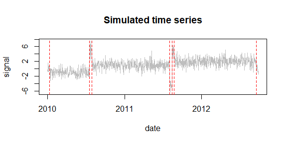
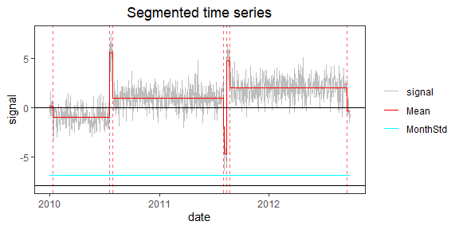
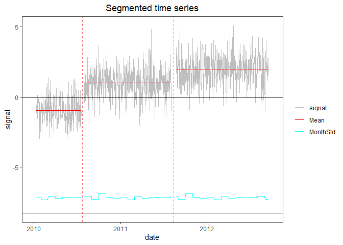

<!-- Example3.md is generated from Example3.Rmd. Please edit that file -->

## Example 3: time series with clusters of CPs

In real data, clusters of CPs can occur in a short period of time or can
be due to noise spikes. In many applications, we don’t want to keep such
clusters with short segments. We have included a screening function
which removes clusters or reduces them to single CPs, depending on the
significance of the change in mean before/after each cluster. If the
change is significant the cluster is replaced by a single CP, otherwise
all the CPs in that cluster are removed.

### 1. Simulate a time series with 2 clusters

    rm(list=ls(all=TRUE))
    library(PMLseg)

    # define simulation function
    simulate_time_series <- function(cp_ind, segmt_mean, noise_stdev, length_series) {
      time_series <- rep(0, length_series)
      jump_indices <- c(1, cp_ind+1, length_series + 1)
      offsets <- c(0, diff(segmt_mean))

      changes <- rep(0, length_series)
      changes[jump_indices[-length(jump_indices)]] <- offsets
      changes[1] <- segmt_mean[1]

      time_series <- cumsum(changes)
      noise <- rnorm(n = length_series, mean = 0, sd = noise_stdev)
      time_series <- time_series + noise

      return(time_series)
    }

    # specify the simulation parameters
    n <- 1000                                       # length of time series
    cp_ind <- c(10, 200, 210, 580, 590, 600, 990)   # 2 clusters of CPs + one short segment at the begining and one at the end
    segmt_mean <- c(0, -1, 5, 1, -5, 5, 2, 0)       # mean of segments
    noise_stdev <- 1                                # noise std dev (identical for all months)
    set.seed(1)                                     # initialise random generator

    # create a data frame of time series with 2 columns: date, signal
    mydate <- seq.Date(from = as.Date("2010-01-01"), to = as.Date("2010-01-01")+(n-1), by = "day")
    mysignal <- simulate_time_series(cp_ind, segmt_mean, noise_stdev, n)
    df <- data.frame(date = mydate, signal = mysignal)

    CP_date <- mydate[cp_ind]                       # dates of CP

    # plot signal and position of change-points
    plot(df$date, df$signal, type = "l", col = "gray", xlab = "date", ylab = "signal", main="Simulated time series")
    abline(v = CP_date, col = "red", lty = 2)

### 2. Segmentation

Run the segmentation without the functional part:

    seg = Segmentation(OneSeries = df, 
                       FunctPart = FALSE)

    seg$Tmu
    #>   begin  end       mean         se  np
    #> 1     1   11  0.1667099 0.31114798  11
    #> 2    12  200 -0.9713045 0.07737888 189
    #> 3   201  210  5.5271484 0.35944691  10
    #> 4   211  580  0.9858219 0.05634461 370
    #> 5   581  590 -4.6640059 0.38365696  10
    #> 6   591  600  4.7472015 0.38365696  10
    #> 7   601  990  1.9793571 0.05450709 390
    #> 8   991 1000 -0.3262317 0.29314546  10

### 3. Visualization of the time series with segmentation results superposed

    PlotSeg(OneSeries = df, 
            SegRes = seg, 
            FunctPart = FALSE)

Note that the segmentation is able to detect all CPs, even those close
to the beginning and end of the time series.

### 4. Cluster screening

We want to remove the segments smaller than 80 days, either isolated or
in clusters.

    cluster_max_dist <- 80             # max distance between CPs in a cluster
    screening <- Cluster_screening(Tmu = seg$Tmu, MaxDist = cluster_max_dist)
    screening
    #> $UpdatedCP
    #> [1] 206 591
    #> 
    #> $RemoveData
    #>   begin  end
    #> 1     1   11
    #> 2   201  210
    #> 3   581  600
    #> 4   991 1000
    #> 
    #> $ChangeCP
    #> [1] "Yes"

The Cluster\_screening function returns information to update the
segmentation dataframe.

Now, update the segmentation parameters

    seg_updated <- UpdatedParametersForFixedCP(OneSeries = df, ResScreening = screening, FunctPart=FALSE)
    seg_updated
    #> $MonthVar
    #>  [1] 1.1281267 0.8867889 1.3344776 1.0922765 1.2098637 1.1702334 1.2043480
    #>  [8] 1.4346685 0.9308744 1.8745634 1.2375832 1.1062817
    #> 
    #> $Tmu
    #>   begin  end       mean         se  np
    #> 1     1  206 -0.9723087 0.07737455 189
    #> 2   207  591  0.9855249 0.05651114 370
    #> 3   592 1000  1.9801639 0.05477701 390
    #> 
    #> $FitF
    #> [1] FALSE
    #> 
    #> $CoeffF
    #> [1] FALSE
    #> 
    #> $SSR
    #> [1] 860.383

Plot the time series with the updated segmentation information and mask
the data removed by the screening (`RemoveData` option).

    PlotSeg(OneSeries = df, SegRes = seg_updated, FunctPart = FALSE, RemoveData = screening$RemoveData)

Note that the data in the clusters are only masked in the plot. They are
still contained in the time series dataframe. It is recommended to
replace tham with NA values or to actually remove them from the data
frame.
