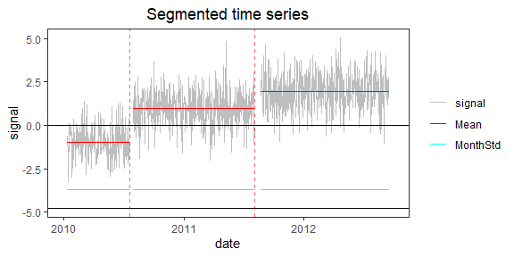
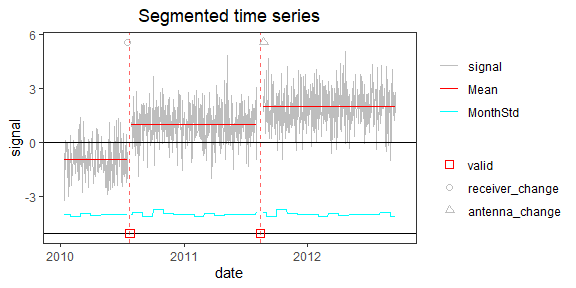

<!-- Example3.md is generated from Example3.Rmd. Please edit that file -->

## Example 3: time series with clusters of CPs

In real data, clusters of CPs can occur in a short period of time or can
be due to noise spikes. In many applications, we don’t want to keep such
clusters with short segments. We have included a screening function
which removes clusters or reduces them to single CPs, depending on the
significance of the change in mean before/after each cluster. If the
change is significant the cluster is replaced by a single CP, otherwise
all the CPs in that cluster are removed.

### 1. Simulate a time series with 2 clusters

    rm(list=ls(all=TRUE))
    library(PMLseg)

    # define simulation function
    simulate_time_series <- function(cp_ind, segmt_mean, noise_stdev, length_series) {
      time_series <- rep(0, length_series)
      jump_indices <- c(1, cp_ind+1, length_series + 1)
      offsets <- c(0, diff(segmt_mean))

      changes <- rep(0, length_series)
      changes[jump_indices[-length(jump_indices)]] <- offsets
      changes[1] <- segmt_mean[1]

      time_series <- cumsum(changes)
      noise <- rnorm(n = length_series, mean = 0, sd = noise_stdev)
      time_series <- time_series + noise

      return(time_series)
    }

    # specify the simulation parameters
    n <- 1000                                       # length of time series
    cp_ind <- c(10, 200, 210, 580, 590, 600, 990)   # 2 clusters of CPs + one short segment at the begining and one at the end
    segmt_mean <- c(0, -1, 5, 1, -5, 5, 2, 0)       # mean of segments
    noise_stdev <- 1                                # noise std dev (identical for all months)
    set.seed(1)                                     # initialise random generator

    # create a data frame of time series with 2 columns: date, signal
    mydate <- seq.Date(from = as.Date("2010-01-01"), to = as.Date("2010-01-01")+(n-1), by = "day")
    mysignal <- simulate_time_series(cp_ind, segmt_mean, noise_stdev, n)
    df <- data.frame(date = mydate, signal = mysignal)

    CP_date <- mydate[cp_ind]                       # dates of CP

    # plot signal and position of change-points
    plot(df$date, df$signal, type = "l", col = "gray", xlab = "date", ylab = "signal", main="Simulated time series")
    abline(v = CP_date, col = "red", lty = 2)

### 2. Segmentation

Run the segmentation without the functional part:

    seg = Segmentation(OneSeries = df, 
                       FunctPart = FALSE)

    seg$Tmu
    #>   begin  end     tbegin       tend       mean         se  np
    #> 1     1   11 2010-01-01 2010-01-11  0.1667099 0.31114798  11
    #> 2    12  200 2010-01-12 2010-07-19 -0.9713045 0.07737888 189
    #> 3   201  210 2010-07-20 2010-07-29  5.5271484 0.35944691  10
    #> 4   211  580 2010-07-30 2011-08-03  0.9858219 0.05634461 370
    #> 5   581  590 2011-08-04 2011-08-13 -4.6640059 0.38365696  10
    #> 6   591  600 2011-08-14 2011-08-23  4.7472015 0.38365696  10
    #> 7   601  990 2011-08-24 2012-09-16  1.9793571 0.05450709 390
    #> 8   991 1000 2012-09-17 2012-09-26 -0.3262317 0.29314546  10

### 3. Visualization of the time series with segmentation results superposed

    PlotSeg(OneSeries = df, 
            SegRes = seg, 
            FunctPart = FALSE)

Note that the segmentation is able to detect all CPs, even those close
to the beginning and end of the time series.

### 4. Cluster screening

We want to remove the segments smaller than 80 days, either isolated or
in clusters.

    cluster_max_dist <- 80             # max distance between CPs in a cluster
    screening <- Cluster_screening(Tmu = seg$Tmu, MaxDist = cluster_max_dist)
    screening
    #> $UpdatedCP
    #> [1] 206 591
    #> 
    #> $RemoveData
    #>   begin  end
    #> 1     1   11
    #> 2   201  210
    #> 3   581  600
    #> 4   991 1000
    #> 
    #> $ChangeCP
    #> [1] "Yes"

The Cluster\_screening function returns information to update the
segmentation dataframe.

Now, update the segmentation parameters and the time serie

    seg_updated <- UpdatedParametersForFixedCP(OneSeries = df, ResScreening = screening, FunctPart=FALSE)
    seg_updated
    #> $MonthVar
    #>  [1] 1.1281267 0.8867889 1.3344776 1.0922765 1.2098637 1.1702334 1.2043480 1.4346685 0.9308744 1.8745634 1.2375832 1.1062817
    #> 
    #> $Tmu
    #>   begin  end     tbegin       tend       mean         se  np
    #> 1     1  206 2010-01-01 2010-07-25 -0.9723087 0.07737455 189
    #> 2   207  591 2010-07-26 2011-08-14  0.9855249 0.05651114 370
    #> 3   592 1000 2011-08-15 2012-09-26  1.9801639 0.05477701 390
    #> 
    #> $FitF
    #> [1] FALSE
    #> 
    #> $CoeffF
    #> [1] FALSE
    #> 
    #> $SSR
    #> [1] 860.383

Plot the time series with the updated segmentation information and mask
the data removed by the screening (`RemoveData` option).

    PlotSeg(OneSeries = df, SegRes = seg_updated, FunctPart = FALSE, RemoveData = screening$RemoveData)

Note that the data in the clusters are only masked in the plot. They are
still contained in the time series dataframe. So it is necessary to
update also `df`. Two options are possible: either replace the data
removed by the screening with NA values in `df$signal` or simply remove
the data from `df`. This step is mandoroty before running again the
Validation.

    df_screened <- df
    for (i in 1:(nrow(screening$RemoveData))) {
        df_screened$signal[screening$RemoveData$begin[i]:screening$RemoveData$end[i]] = NA
    }

### 5. Validation of change-points after screening

    # define fake metadata from true CP dates
    meta_date <- CP_date[c(2, 6)]                                  # date of metadata event = date of CP
    meta_type <- c("receiver_change", "antenna_change")   # type of metadata event
    metadata = data.frame(date = meta_date, type = meta_type)
    valid_max_dist = 10               # max distance between CP and metadata for the validation
    valid = Validation(OneSeries = df_screened, Tmu = seg_updated$Tmu, MaxDist = valid_max_dist, Metadata = metadata)
    valid
    #> # A tibble: 2 × 5
    #>   CP         closestMetadata Distance type            valid
    #>   <date>     <date>             <dbl> <chr>           <dbl>
    #> 1 2010-07-25 2010-07-19             0 receiver_change     1
    #> 2 2011-08-14 2011-08-23            -1 antenna_change      1

    p <- PlotSeg(OneSeries = df_screened, SegRes = seg_updated, FunctPart = FALSE, Metadata = metadata, Validated_CP_Meta = valid)
    print(p)

