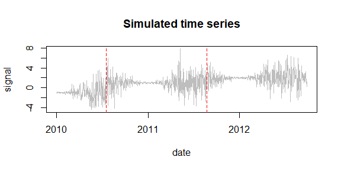
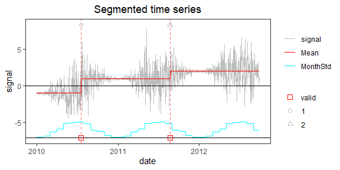

<!-- Example4.md is generated from Example4.Rmd. Please edit that file -->

## Example 4: time series with monthly varying variance

### 1. Simulate a time series with one different variance every calendar month

    rm(list=ls(all=TRUE))
    library(PMLseg)

    # define simulation function
    simulate_time_series <- function(cp_ind, segmt_mean, noise_stdev, length_series) {
      time_series <- rep(0, length_series)
      jump_indices <- c(1, cp_ind+1, length_series + 1)
      offsets <- c(0, diff(segmt_mean))

      changes <- rep(0, length_series)
      changes[jump_indices[-length(jump_indices)]] <- offsets
      changes[1] <- segmt_mean[1]
      time_series <- cumsum(changes)

      noise <- rnorm(n = length_series, mean = 0, sd = 1)
      sd = noise_stdev[as.numeric(format(mydate, "%m"))]
      time_series <- time_series + noise * sd

      return(time_series)
    }

    # specify the simulation parameters
    date_begin <- as.Date("2010-01-01") # date of first data point
    n <- 1000                           # length of time series
    cp_ind <- c(200, 600)               # position of change points (index in time series)
    segmt_mean <- c(-1, 1, 2)           # mean value of segments
    noise_stdev <- c(0.1, 0.3, 0.7, 1.2, 1.8, 2, 2, 1.8, 1.2, 0.7, 0.3, 0.1) # 12 values, one per month (Jan to Dec)
    set.seed(1)                         # initialise random generator

    # create a data frame of time series with 2 columns: date, signal
    date_end <- date_begin + n - 1
    mydate <- seq.Date(from = date_begin, to = date_end, by = "day")
    mysignal <- simulate_time_series(cp_ind, segmt_mean, noise_stdev, n)
    myseries <- data.frame(date = mydate, signal = mysignal)

    # plot signal and position of change-points (red dashed line)
    CP_date <- mydate[cp_ind]
    plot(myseries$date, myseries$signal, type = "l", col = "gray", xlab = "date", ylab = "signal", main="Simulated time series")
    abline(v = CP_date, col = "red", lty = 2)

    # define fake metadata from true CP dates
    meta_date <- CP_date              # date of metadata event = date of CP
    meta_type <- c("1", "2")          # type of metadata event
    metadata = data.frame(date = meta_date, type = meta_type)

### 2. Segmentation

Run the segmentation with default parameters:

    SegRes = Segmentation(OneSeries = myseries, 
                          FunctPart = FALSE)

    SegRes$Tmu
    #>   begin  end     tbegin       tend       mean         se  np
    #> 1     1  200 2010-01-01 2010-07-19 -0.9851706 0.01745298 200
    #> 2   201  601 2010-07-20 2011-08-24  0.9995062 0.01246875 401
    #> 3   602 1000 2011-08-25 2012-09-26  1.9948656 0.01244232 399

### 3. Validate estimated change-point positions

    valid <- Validation(OneSeries = myseries, 
               Tmu = SegRes$Tmu,
               MaxDist =  10,
               Metadata = metadata)
    valid
    #>           CP closestMetadata type Distance valid
    #> 1 2010-07-19      2010-07-19    1        0     1
    #> 2 2011-08-24      2011-08-23    2        1     1

### 4. Visualization of the time series with segmentation and validation results superposed

    PlotSeg(OneSeries = myseries, 
            SegRes = SegRes, 
            FunctPart = FALSE,
            Metadata = metadata, 
            Validated_CP_Meta = valid)

Note: the segmentation detects well the position of change points
despite the steep variations in the noise

### 5. Evaluate the error of the estimated noise variance

    error <- SegRes$MonthVar - noise_stdev ** 2
    error / (noise_stdev ** 2)
    #>  [1]  0.08875807 -0.11321115  0.33447764  0.09227653  0.20986374  0.17023340  0.18342544  0.22360029 -0.16599028  0.87456341
    #> [11]  0.23758318  0.10628167

The relative error on some months is quite large.

Increasing the length of the time series (i.e. including more years)
would improve the accuracy of the noise variance estimation.
