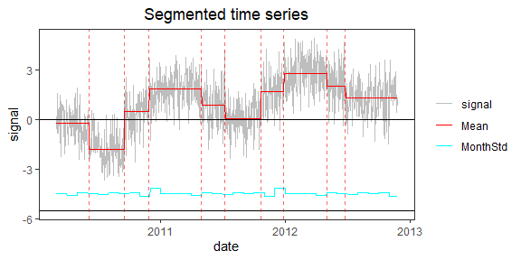
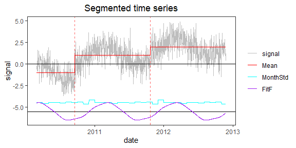
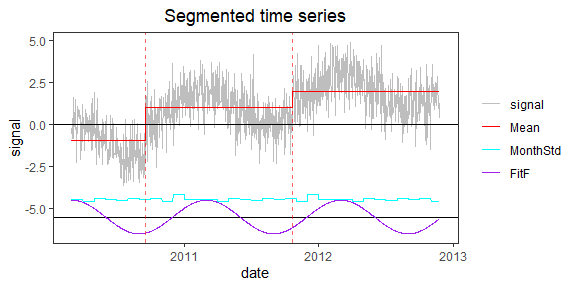

<!-- Example5.md is generated from Example5.Rmd. Please edit that file -->

## Example 5: time series with periodic bias

### 1. Simulate a time series with periodic bias and constant noise variance

    rm(list=ls(all=TRUE))
    library(PMLseg)

    # define simulation function
    simulate_time_series <- function(cp_ind, segmt_mean, noise_stdev, length_series) {
      time_series <- rep(0, length_series)
      jump_indices <- c(1, cp_ind+1, length_series + 1)
      offsets <- c(0, diff(segmt_mean))

      changes <- rep(0, length_series)
      changes[jump_indices[-length(jump_indices)]] <- offsets
      changes[1] <- segmt_mean[1]
      time_series <- cumsum(changes)

      sd = noise_stdev[as.numeric(format(mydate, "%m"))]
      noise <- rnorm(n = length_series, mean = 0, sd = 1)
      time_series <- time_series + noise * sd

      return(time_series)
    }

    # specify the simulation parameters
    date_begin <- as.Date("2010-03-01") # date of first data point
    n <- 1000                            # length of time series
    cp_ind <- c(200, 600)               # position of change points (index in time series)
    segmt_mean <- c(-1, 1, 2)           # mean value of segments
    noise_stdev <- rep(1, 12)         # noise variance (Jan to Dec)
    coeff <- c(1, 0, 0, 0)              # Fourier Series coefficients (cos1, sin1, cos2, sin2...) up to order 4
    set.seed(1)

    # create a time series OneSeries with jumps and noise
    mydate <- seq.Date(from = date_begin, to = date_begin + n - 1, by = "day")
    mysignal <- simulate_time_series(cp_ind, segmt_mean, noise_stdev, n)
    CP_date <- mydate[cp_ind]

    # create a periodic function (Fourier series)
    T <- 365.25                             # reference period (unit days)
    t <- as.numeric(mydate)                 # time variable for periodic function
    t0 <- as.numeric(mydate[1])             # reference date of periodic function is first date of time series
    p <- length(coeff) / 2                  # order of Fourier Series
    f <- rowSums(sapply(1:p, function(i) coeff[2*i-1]*cos(i*(t-t0+1)*(2*pi)/T) + coeff[2*i]*sin(i*(t-t0+1)*(2*pi)/T)))

    # add periodic function to the signal
    mysignal <- mysignal + f
    OneSeries <- data.frame(date = mydate, signal = mysignal)

    # plot signal and position of change-points (red dashed line)
    plot(OneSeries$date, OneSeries$signal, type = "l", col = "gray", xlab = "date", ylab = "signal", main="Simulated time series")
    abline(v = CP_date, col = "red", lty = 2)

### 2. Segmentation

#### a. Run the segmentation without the functional part to see what happens

    seg_nofunc <- Segmentation(OneSeries = OneSeries, FunctPart = FALSE)
    seg_nofunc$Tmu
    #>    begin  end     tbegin       tend        mean         se  np
    #> 1      1   96 2010-03-01 2010-06-04 -0.23273344 0.10444403  96
    #> 2     97  200 2010-06-05 2010-09-16 -1.80556037 0.10387458 104
    #> 3    201  273 2010-09-17 2010-11-28  0.46085638 0.11901862  73
    #> 4    274  426 2010-11-29 2011-04-30  1.83490024 0.08661095 153
    #> 5    427  495 2011-05-01 2011-07-08  0.84603599 0.12860140  69
    #> 6    496  600 2011-07-09 2011-10-21  0.05691218 0.10490580 105
    #> 7    601  667 2011-10-22 2011-12-27  1.68684853 0.13063495  67
    #> 8    668  794 2011-12-28 2012-05-02  2.80094194 0.09167862 127
    #> 9    795  848 2012-05-03 2012-06-25  2.01251370 0.14661834  54
    #> 10   849 1000 2012-06-26 2012-11-24  1.28919902 0.08452552 152
    PlotSeg(OneSeries = OneSeries, SegRes = seg_nofunc, FunctPart = FALSE)

The segmentation captures the periodic signal.

#### b. Run the segmentation with the functional part

    seg <- Segmentation(OneSeries = OneSeries, FunctPart = TRUE)
    seg$Tmu
    #>   begin  end     tbegin       tend       mean         se  np
    #> 1     1  200 2010-03-01 2010-09-16 -0.9811789 0.07365093 200
    #> 2   201  600 2010-09-17 2011-10-21  0.9927344 0.05305705 400
    #> 3   601 1000 2011-10-22 2012-11-24  1.9736524 0.05240993 400
    seg$CoeffF
    #>         cos1         sin1         cos2         sin2         cos3         sin3 
    #>  0.999934155 -0.004612869  0.029097601  0.045766870 -0.022228194 -0.011661756 
    #>         cos4         sin4 
    #>  0.020905585  0.044686867
    seg$MonthVar
    #>  [1] 1.1532654 1.1021487 1.0726657 0.9078918 1.1828747 1.1362753 1.0182985
    #>  [8] 1.2283415 1.1333834 1.2671579 0.8289470 1.8600646
    seg$SSR
    #> [1] 949.3834
    sum(seg$CoeffF^2)
    #> [1] 1.005895
    PlotSeg(OneSeries = OneSeries, SegRes = seg, FunctPart = TRUE)

The segmentation now captures the CPs, at the right position, but the
periodic signal is not well estimated by the functional part.

#### c. Run segmentation with functional and selection of statistically significant coefficients

    seg = Segmentation(OneSeries = OneSeries, FunctPart = TRUE, selectionF = TRUE)
    seg$Tmu
    #>   begin  end     tbegin       tend       mean         se  np
    #> 1     1  200 2010-03-01 2010-09-16 -0.9766652 0.07365093 200
    #> 2   201  600 2010-09-17 2011-10-21  0.9978349 0.05305705 400
    #> 3   601 1000 2011-10-22 2012-11-24  1.9681193 0.05240993 400
    seg$CoeffF
    #>     cos1 
    #> 1.006829
    seg$MonthVar
    #>  [1] 1.1532654 1.1021487 1.0726657 0.9078918 1.1828747 1.1362753 1.0182985
    #>  [8] 1.2283415 1.1333834 1.2671579 0.8289470 1.8600646
    seg$SSR
    #> [1] 952.2987
    sum(seg$CoeffF^2)
    #> [1] 1.013704
    PlotSeg(OneSeries = OneSeries, SegRes = seg, FunctPart = TRUE)

Both the CPs and functional part now correctly captured.
