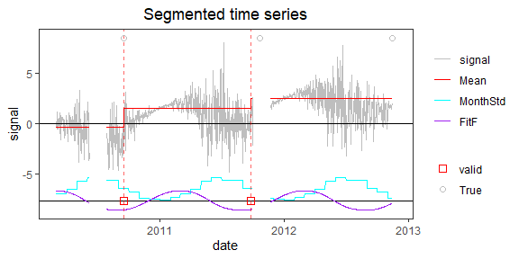
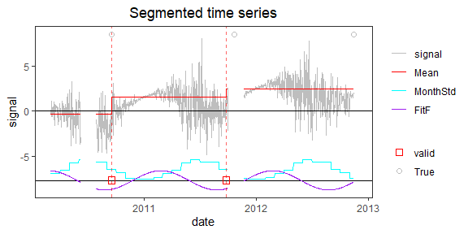

<!-- Example6.md is generated from Example6.Rmd. Please edit that file -->

## Example 6: time series with periodic bias, monthly variance, and gaps

### 1. Simulate a time series

    rm(list=ls(all=TRUE))
    library(PMLseg)

    # define simulation function
    simulate_time_series <- function(cp_ind, segmt_mean, noise_stdev, length_series) {
        time_series <- rep(0, length_series)
        cp_indices <- c(1, cp_ind, length_series + 1)
        offsets <- c(0, diff(segmt_mean))

        changes <- rep(0, length_series)
        changes[cp_indices[-length(cp_indices)]] <- offsets
        changes[1] <- segmt_mean[1]
        time_series <- cumsum(changes)

        sd = noise_stdev[as.numeric(format(mydate, "%m"))]
        noise <- rnorm(n = length_series, mean = 0, sd = 1)
        time_series <- time_series + noise * sd

        return(time_series)
    }

    fourier_series <- function(mydate, coeff) {
        T <- 365.25                             # base period (unit days)
        t <- as.numeric(mydate)                 # time variable for periodic function
        t0 <- as.numeric(mydate[1])             # reference date of periodic function is first date of time series
        p <- length(coeff) / 2                  # order of Fourier Series
        f <- rowSums(sapply(1:p, function(i) coeff[2*i-1]*cos(i*(t-t0+1)*(2*pi)/T) + coeff[2*i]*sin(i*(t-t0+1)*(2*pi)/T)))

        return(f)
    }

    # specify the simulation parameters
    date_begin <- as.Date("2010-03-01")              # date of first data point
    n <- 1000                                        # length of time series
    cp_ind <- c(200, 600, 990)                       # position of CPs (index in time series)
    segmt_mean <- c(-1, 1, 2, -1)                    # mean value of segments
    noise_stdev <- c(0.1, 0.3, 0.7, 1.2, 1.8, 2, 2, 1.8, 1.2, 0.7, 0.3, 0.1) # 12 values, one per month (Jan to Dec)
    coeff <- c(1, 0, 0, 0)                           # Fourier Series coefficients (cos1, sin1, cos2, sin2...) up to order 4
    set.seed(1)                                      # initialise random generator

    # create a time series with jumps and noise
    mydate <- seq.Date(from = date_begin, to = date_begin + n - 1, by = "day")
    mysignal <- simulate_time_series(cp_ind, segmt_mean, noise_stdev, n)
    CP_date <- mydate[cp_ind]

    # add a periodic function (Fourier series)
    f <- fourier_series(mydate, coeff)
    mysignal <- mysignal + f

    # add NA's in the signal
    NA_ind = seq(from = 100, to = 150, by = 1)  # 1st gap
    mysignal[NA_ind] <- NA
    NA_ind = seq(from = 580, to = 630, by = 1)  # 2nd gap 
    mysignal[NA_ind] <- NA

    # create myseries with full signal
    myseries <- data.frame(date = mydate, signal = mysignal)

    # plot signal and position of change-points (red dashed line)
    plot(myseries$date, myseries$signal, type = "l", col = "gray", xlab = "date", ylab = "signal", main="Simulated time series")
    abline(v = CP_date, col = "red", lty = 2)

### 2. Segmentation

#### a. Run the segmentation with default parameters

    seg = Segmentation(OneSeries = myseries)
    seg$Tmu
    #>   begin  end     tbegin       tend       mean         se  np
    #> 1     1  199 2010-03-01 2010-09-15 -0.8967092 0.09561914 148
    #> 2   200  571 2010-09-16 2011-09-22  0.9128602 0.01369619 372
    #> 3   572  701 2011-09-23 2012-01-30  1.8608640 0.01494423  79
    #> 4   702  989 2012-01-31 2012-11-13  2.0044065 0.03642282 288
    #> 5   990 1000 2012-11-14 2012-11-24 -1.1441469 0.07603715  11
    seg$CoeffF
    #>        cos1        sin1        cos2        sin2        cos3        sin3        cos4        sin4 
    #>  1.04699518 -0.11479068  0.02674465  0.01993558 -0.05628484  0.02419983 -0.00800733 -0.02794739
    seg$MonthVar
    #>  [1] 0.01129550 0.10001087 0.52627660 1.30869358 3.83242112 5.38775912 4.01748556 3.98183075 1.55847031 0.76260594 0.06359813
    #> [12] 0.01868164
    seg$SSR
    #> [1] 835.1317
    sum(seg$CoeffF^2)
    #> [1] 1.115087

    # validate updated CP position wrt metadata
    metadata <- data.frame(date = myseries$date[cp_ind], type = rep("True", (length(cp_ind))))
    valid <- Validation(OneSeries = myseries, Tmu = seg$Tmu, MaxDist = 10, Metadata = metadata)
    valid
    #>           CP closestMetadata type Distance valid
    #> 1 2010-09-15      2010-09-16 True        1     1
    #> 2 2011-09-22      2011-10-21 True        8     1
    #> 3 2012-01-30      2011-10-21 True       71     0
    #> 4 2012-11-13      2012-11-14 True        1     1

    # Plot the time series with RemoveData option
    PlotSeg(OneSeries = myseries, SegRes = seg, FunctPart = TRUE, Metadata = metadata, Validated_CP_Meta = valid)

A spurious CP is detected, due to confusion between noise, periodic
signal and segmentation. Although the jump has a small amplitude, and
thus a small impact on the predicted signal, a solution with a smaller
number of CPs may be wanted. Therefore, try the segmentation with
`selectionF = TRUE`.

#### b. run segmentation with selection of statistically significant Fourier coefficients

    seg_selectF = Segmentation(OneSeries = myseries, selectionF = TRUE)
    seg_selectF$Tmu
    #>   begin  end     tbegin       tend       mean         se  np
    #> 1     1  199 2010-03-01 2010-09-15 -0.8965279 0.09561914 148
    #> 2   200  574 2010-09-16 2011-09-25  1.0192571 0.01369372 375
    #> 3   575  989 2011-09-26 2012-11-13  1.9883168 0.01382827 364
    #> 4   990 1000 2012-11-14 2012-11-24 -1.0528552 0.07603715  11
    seg_selectF$CoeffF
    #>     cos1 
    #> 1.004161
    seg_selectF$MonthVar
    #>  [1] 0.01129550 0.10001087 0.52627660 1.30869358 3.83242112 5.38775912 4.01748556 3.98183075 1.55847031 0.76260594 0.06359813
    #> [12] 0.01868164
    seg_selectF$SSR
    #> [1] 841.1567
    sum(seg_selectF$CoeffF^2)
    #> [1] 1.008339

    # validate updated CP position wrt metadata
    valid = Validation(OneSeries = myseries, Tmu = seg_selectF$Tmu, MaxDist = 10, Metadata = metadata)
    valid
    #>           CP closestMetadata type Distance valid
    #> 1 2010-09-15      2010-09-16 True        1     1
    #> 2 2011-09-25      2011-10-21 True        5     1
    #> 3 2012-11-13      2012-11-14 True        1     1

    # Plot the time series with RemoveData option
    PlotSeg(OneSeries = myseries, SegRes = seg_selectF, FunctPart = TRUE, Metadata = metadata, Validated_CP_Meta = valid)

The solution with selection does not have the spurious CP. Selection
helps to reduce the confusion between periodic signal and segmentation.

### 3. Cluster screening

Now run the cluster screening to remove the small segment at the end of
time series.

    # run the cluster screening with max distance between CPs in a cluster of 80 days
    screening <- Cluster_screening(Tmu = seg_selectF$Tmu, MaxDist = 80)
    screening
    #> $UpdatedCP
    #> [1] 199 574
    #> 
    #> $RemoveData
    #>   begin  end
    #> 1   990 1000
    #> 
    #> $ChangeCP
    #> [1] "Yes"

    # update the segmentation results if CPs have changed
    if (screening$ChangeCP == "Yes") {
        myseries_updated <- UpdateTimeSeries(OneSeries = myseries, screening$RemoveData)
        seg_updated <- UpdatedParametersForFixedCP(OneSeriesUpd = myseries, UpdatedCP = screening$UpdatedCP, FunctPart=TRUE)
    } else {
        myseries_updated <- myseries
        seg_updated <- seg_selectF
    }

    seg_updated$Tmu
    #>   begin  end     tbegin       tend       mean         se  np
    #> 1     1  199 2010-03-01 2010-09-15 -0.3753573 0.09561914 148
    #> 2   200  574 2010-09-16 2011-09-25  1.5036789 0.01369372 375
    #> 3   575 1000 2011-09-26 2012-11-24  2.3676473 0.01360512 375
    seg_updated$CoeffF
    #>         cos1         sin1         cos2         sin2         cos3         sin3         cos4         sin4 
    #>  1.020716073  0.055655090  0.066497773  0.008607625 -0.050395883 -0.150476551  0.052732220  0.165367199
    seg_updated$MonthVar
    #>  [1] 0.01129550 0.10001087 0.52627660 1.30869358 3.83242112 5.38775912 4.01748556 3.98183075 1.55847031 0.76260594 0.06359813
    #> [12] 0.01868164
    seg_updated$SSR
    #> [1] 2219.188
    sum(seg_updated$CoeffF^2)
    #> [1] 1.104765

    # plot the series with updated segmentation results
    valid <- Validation(OneSeries = myseries_updated, Tmu = seg_updated$Tmu, MaxDist = 10, Metadata = metadata)
    PlotSeg(OneSeries = myseries_updated, SegRes = seg_updated, FunctPart = TRUE, Metadata = metadata, Validated_CP_Meta = valid)

The `UpdatedParametersForFixedCP` has an option to select the
statistically significant Fourier coefficients `selectionF = TRUE`:

    # update the segmentation results with selectionF = TRUE
    if (screening$ChangeCP == "Yes") {
        myseries_updated <- UpdateTimeSeries(OneSeries = myseries, screening$RemoveData)
        seg_updated <- UpdatedParametersForFixedCP(OneSeries = myseries_updated, UpdatedCP = screening$UpdatedCP, FunctPart=TRUE, selectionF = TRUE)
    } else {
        myseries_updated <- myseries
        seg_updated <- seg_selectF
    }

    seg_updated$Tmu
    #>   begin  end     tbegin       tend       mean         se  np
    #> 1     1  199 2010-03-01 2010-09-15 -0.3753573 0.09561914 148
    #> 2   200  574 2010-09-16 2011-09-25  1.5044014 0.01370054 375
    #> 3   575 1000 2011-09-26 2012-11-24  2.4872546 0.01383366 364
    seg_updated$CoeffF
    #> NULL
    seg_updated$MonthVar
    #>  [1] 0.01129550 0.10001087 0.52627660 1.30869358 3.83242112 5.38775912 4.01748556 3.98183075 1.55847031 0.76260594 0.06432260
    #> [12] 0.01868164
    seg_updated$SSR
    #> [1] 831.79
    sum(seg_updated$CoeffF^2)
    #> [1] 0

    # plot the series with updated segmentation results
    valid <- Validation(OneSeries = myseries_updated, Tmu = seg_updated$Tmu, MaxDist = 10, Metadata = metadata)
    PlotSeg(OneSeries = myseries_updated, SegRes = seg_updated, FunctPart = TRUE, Metadata = metadata, Validated_CP_Meta = valid)

