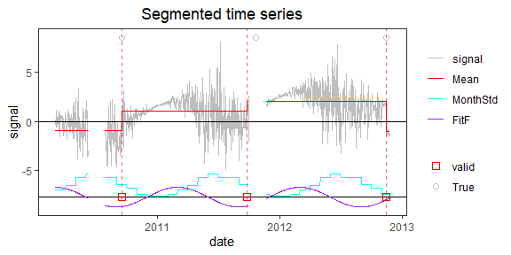
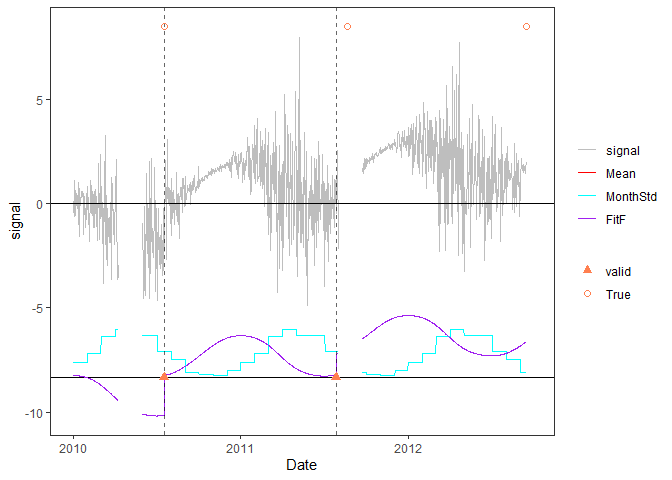

<!-- Example6.md is generated from Example6.Rmd. Please edit that file -->

## Example 6: time series with periodic bias, monthly variance, and gaps

### 1. Simulate a time series

    rm(list=ls(all=TRUE))
    library(PMLseg)

    # define simulation function
    simulate_time_series <- function(cp_ind, segmt_mean, noise_stdev, length_series) {
        time_series <- rep(0, length_series)
        cp_indices <- c(1, cp_ind, length_series + 1)
        offsets <- c(0, diff(segmt_mean))

        changes <- rep(0, length_series)
        changes[cp_indices[-length(cp_indices)]] <- offsets
        changes[1] <- segmt_mean[1]
        time_series <- cumsum(changes)

        sd = noise_stdev[as.numeric(format(mydate, "%m"))]
        noise <- rnorm(n = length_series, mean = 0, sd = 1)
        time_series <- time_series + noise * sd

        return(time_series)
    }

    fourier_series <- function(mydate, coeff) {
        T <- 365.25                             # base period (unit days)
        t <- as.numeric(mydate)                 # time variable for periodic function
        t0 <- as.numeric(mydate[1])             # reference date of periodic function is first date of time series
        p <- length(coeff) / 2                  # order of Fourier Series
        f <- rowSums(sapply(1:p, function(i) coeff[2*i-1]*cos(i*(t-t0+1)*(2*pi)/T) + coeff[2*i]*sin(i*(t-t0+1)*(2*pi)/T)))

        return(f)
    }

    # specify the simulation parameters
    date_begin <- as.Date("2010-03-01")             # date of first data point
    n <- 1000                                        # length of time series
    #cp_ind <- c(200, 600, 990)                      # position of CPs (index in time series)
    #segmt_mean <- c(-1, 1, 2, 0)                    # mean value of segments
    cp_ind <- c(200, 600)                      # position of CPs (index in time series)
    segmt_mean <- c(-1, 1, 2)                    # mean value of segments
    noise_stdev <- c(0.1, 0.3, 0.7, 1.2, 1.8, 2, 2, 1.8, 1.2, 0.7, 0.3, 0.1) # 12 values, one per month (Jan to Dec)
    coeff <- c(1, 0, 0, 0)                          # Fourier Series coefficients (cos1, sin1, cos2, sin2...) up to order 4
    set.seed(1)                                     # initialise random generator

    # create a time series with jumps and noise
    mydate <- seq.Date(from = date_begin, to = date_begin + n - 1, by = "day")
    mysignal <- simulate_time_series(cp_ind, segmt_mean, noise_stdev, n)

    # add NA's in the signal
    NA_ind = seq(from = 100, to = 150, by = 1)  # 1st gap
    mysignal[NA_ind] <- NA
    NA_ind = seq(from = 580, to = 630, by = 1)  # 2nd gap 
    mysignal[NA_ind] <- NA

    # add a periodic function (Fourier series)
    f <- fourier_series(mydate, coeff)
    mysignal <- mysignal + f

    # create df with full signal
    df <- data.frame(date = mydate, signal = mysignal)

    # plot signal and position of change-points (red dashed line)
    plot(df$date, df$signal, type = "l")
    abline(v = mydate[cp_ind], col = "red", lty = 2)

### 2. Segmentation

#### a. Run the segmentation with default parameters:

    seg = Segmentation(OneSeries = df, FunctPart = TRUE)
    seg$Tmu
    #>   begin  end       mean         se  np
    #> 1     1  199 -0.9303097 0.09561914 148
    #> 2   200  571  0.8909008 0.01361954 372
    #> 3   572 1000  1.8587558 0.01351768 378
    seg$CoeffF
    #>        cos1        sin1        cos2        sin2        cos3        sin3 
    #>  1.08400863 -0.17397318  0.05361611  0.06682652 -0.04008531  0.01605339 
    #>        cos4        sin4 
    #> -0.00906388 -0.01792224
    seg$MonthVar
    #>  [1] 0.01129550 0.10001087 0.52627660 1.30869358 3.83242112 5.38775912
    #>  [7] 4.01748556 3.98183075 1.55847031 0.76260594 0.05640351 0.01868164
    seg$SSR
    #> [1] 856.3094
    sum(seg$CoeffF^2)
    #> [1] 1.21495
    PlotSeg(OneSeries = df, SegRes = seg, FunctPart = TRUE)

#### b. run segmentation with selection of statistically significant Fourier coefficients

    seg_selectF = Segmentation(OneSeries = df, FunctPart = TRUE, selectionF = TRUE)
    seg_selectF$Tmu
    #>   begin  end       mean         se  np
    #> 1     1  199 -0.8970308 0.09561914 148
    #> 2   200  574  1.0188421 0.01361711 375
    #> 3   575 1000  1.9866806 0.01352006 375
    seg_selectF$CoeffF
    #>    cos1 
    #> 1.00513
    seg_selectF$MonthVar
    #>  [1] 0.01129550 0.10001087 0.52627660 1.30869358 3.83242112 5.38775912
    #>  [7] 4.01748556 3.98183075 1.55847031 0.76260594 0.05640351 0.01868164
    seg_selectF$SSR
    #> [1] 850.4401
    sum(seg_selectF$CoeffF^2)
    #> [1] 1.010286
    PlotSeg(OneSeries = df, SegRes = seg_selectF, FunctPart = TRUE)

### 3. Cluster screening

It is safe to always run the cluster screening after the segmentation.

    # run the cluster screening
    cluster_max_dist <- 80             # max distance between CPs in a cluster
    screening <- Cluster_screening(Tmu = seg_selectF$Tmu, MaxDist = cluster_max_dist)
    screening
    #> $UpdatedCP
    #> [1] 199 574
    #> 
    #> $RemoveData
    #>   begin end
    #> 1    NA  NA
    #> 
    #> $ChangeCP
    #> [1] "No"

    # update the segmentation dataframe if CPs have changed
    if (screening$ChangeCP == "Yes") {
        seg_updated <- UpdatedParametersForFixedCP(OneSeries = df, ResScreening = screening, FunctPart=TRUE)
    } else {
        seg_updated <- seg_selectF
    }

### 4. validate updated CP position wrt metadata

    true_cp_ind <- cp_ind
    true_cp_df <- data.frame(date = df$date[true_cp_ind], type = rep("True", (length(true_cp_ind))))
    valid_max_dist <- 10               # max distance between CP and metadata for the validation
    valid <- Validation(OneSeries = df, Tmu = seg_updated$Tmu, MaxDist = valid_max_dist, Metadata = true_cp_df)
    valid
    #> # A tibble: 2 × 5
    #>   CP         closestMetadata Distance type  valid
    #>   <date>     <date>             <dbl> <chr> <dbl>
    #> 1 2010-09-15 2010-09-16             1 True      1
    #> 2 2011-09-25 2011-10-21             5 True      1

### 5. Plot the time series

    PlotSeg(OneSeries = df, SegRes = seg_updated, FunctPart = TRUE, Metadata = true_cp_df, Validated_CP_Meta = valid, RemoveData = screening$RemoveData)

Remember that the data in the clusters are hidden in the Plot but are
still in the time series dataframe. To remove them from the data see
Example3.md.
