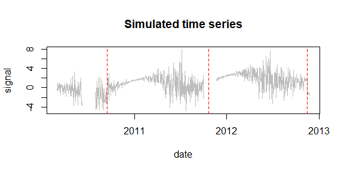

<!-- Example7.md is generated from Example7.Rmd. Please edit that file -->

## Example 7: Explore the different penalty criteria

We take the same simulated signal as in Example6, i.e. with periodic
bias, monthly variance, and gaps.

### 1. Simulate a time series

    rm(list=ls(all=TRUE))
    library(PMLseg)

    # define simulation function
    simulate_time_series <- function(cp_ind, segmt_mean, noise_stdev, length_series) {
        time_series <- rep(0, length_series)
        cp_indices <- c(1, cp_ind, length_series + 1)
        offsets <- c(0, diff(segmt_mean))

        changes <- rep(0, length_series)
        changes[cp_indices[-length(cp_indices)]] <- offsets
        changes[1] <- segmt_mean[1]
        time_series <- cumsum(changes)

        sd = noise_stdev[as.numeric(format(mydate, "%m"))]
        noise <- rnorm(n = length_series, mean = 0, sd = 1)
        time_series <- time_series + noise * sd

        return(time_series)
    }

    fourier_series <- function(mydate, coeff) {
        T <- 365.25                             # base period (unit days)
        t <- as.numeric(mydate)                 # time variable for periodic function
        t0 <- as.numeric(mydate[1])             # reference date of periodic function is first date of time series
        p <- length(coeff) / 2                  # order of Fourier Series
        f <- rowSums(sapply(1:p, function(i) coeff[2*i-1]*cos(i*(t-t0+1)*(2*pi)/T) + coeff[2*i]*sin(i*(t-t0+1)*(2*pi)/T)))

        return(f)
    }

    # specify the simulation parameters
    date_begin <- as.Date("2010-03-01")             # date of first data point
    n <- 1000                                        # length of time series
    cp_ind <- c(200, 600, 990)                      # position of CPs (index in time series)
    segmt_mean <- c(-1, 1, 2, -1)                    # mean value of segments
    noise_stdev <- c(0.1, 0.3, 0.7, 1.2, 1.8, 2, 2, 1.8, 1.2, 0.7, 0.3, 0.1) # 12 values, one per month (Jan to Dec)
    coeff <- c(1, 0, 0, 0)                          # Fourier Series coefficients (cos1, sin1, cos2, sin2...) up to order 4
    set.seed(1)                                     # initialise random generator

    # create a time series with jumps and noise
    mydate <- seq.Date(from = date_begin, to = date_begin + n - 1, by = "day")
    mysignal <- simulate_time_series(cp_ind, segmt_mean, noise_stdev, n)
    CP_date <- mydate[cp_ind]                       # dates of CP

    # add a periodic function (Fourier series)
    f <- fourier_series(mydate, coeff)
    mysignal <- mysignal + f

    # add NA's in the signal
    NA_ind = seq(from = 100, to = 150, by = 1)  # 1st gap
    mysignal[NA_ind] <- NA
    NA_ind = seq(from = 580, to = 630, by = 1)  # 2nd gap 
    mysignal[NA_ind] <- NA

    # create df with full signal
    df <- data.frame(date = mydate, signal = mysignal)

    # plot signal and position of change-points (red dashed line)
    plot(df$date, df$signal, type = "l", col = "gray", xlab = "date", ylab = "signal", main="Simulated time series")
    abline(v = CP_date, col = "red", lty = 2)

### 2. Segmentation

#### a. Run the segmentation with `selectionK = "All"`

    seg = Segmentation(OneSeries = df, FunctPart = TRUE, selectionK = "All")
    seg$Tmu
    #> $mBIC
    #>   begin  end     tbegin       tend       mean         se  np
    #> 1     1  199 2010-03-01 2010-09-15 -0.9320301 0.09561914 148
    #> 2   200  571 2010-09-16 2011-09-22  0.8812958 0.01369619 372
    #> 3   572  989 2011-09-23 2012-11-13  1.8504464 0.01382573 367
    #> 4   990 1000 2012-11-14 2012-11-24 -1.1943639 0.07603715  11
    #> 
    #> $Lav
    #>   begin  end     tbegin       tend       mean         se  np
    #> 1     1  199 2010-03-01 2010-09-15 -0.9320301 0.09561914 148
    #> 2   200  571 2010-09-16 2011-09-22  0.8812958 0.01369619 372
    #> 3   572  989 2011-09-23 2012-11-13  1.8504464 0.01382573 367
    #> 4   990 1000 2012-11-14 2012-11-24 -1.1943639 0.07603715  11
    #> 
    #> $BM_BJ
    #>   begin  end     tbegin       tend       mean         se  np
    #> 1     1  199 2010-03-01 2010-09-15 -0.8967092 0.09561914 148
    #> 2   200  571 2010-09-16 2011-09-22  0.9128602 0.01369619 372
    #> 3   572  701 2011-09-23 2012-01-30  1.8608640 0.01494423  79
    #> 4   702  989 2012-01-31 2012-11-13  2.0044065 0.03642282 288
    #> 5   990 1000 2012-11-14 2012-11-24 -1.1441469 0.07603715  11
    #> 
    #> $BM_slope
    #>   begin  end     tbegin       tend       mean         se  np
    #> 1     1  199 2010-03-01 2010-09-15 -0.8967092 0.09561914 148
    #> 2   200  571 2010-09-16 2011-09-22  0.9128602 0.01369619 372
    #> 3   572  701 2011-09-23 2012-01-30  1.8608640 0.01494423  79
    #> 4   702  989 2012-01-31 2012-11-13  2.0044065 0.03642282 288
    #> 5   990 1000 2012-11-14 2012-11-24 -1.1441469 0.07603715  11
    seg$CoeffF
    #> $mBIC
    #>         cos1         sin1         cos2         sin2         cos3         sin3 
    #>  1.090574034 -0.185650095  0.055823722  0.070116310 -0.042969772  0.018773767 
    #>         cos4         sin4 
    #> -0.008329338 -0.021716599 
    #> 
    #> $Lav
    #>         cos1         sin1         cos2         sin2         cos3         sin3 
    #>  1.090574034 -0.185650095  0.055823722  0.070116310 -0.042969772  0.018773767 
    #>         cos4         sin4 
    #> -0.008329338 -0.021716599 
    #> 
    #> $BM_BJ
    #>        cos1        sin1        cos2        sin2        cos3        sin3 
    #>  1.04699518 -0.11479068  0.02674465  0.01993558 -0.05628484  0.02419983 
    #>        cos4        sin4 
    #> -0.00800733 -0.02794739 
    #> 
    #> $BM_slope
    #>        cos1        sin1        cos2        sin2        cos3        sin3 
    #>  1.04699518 -0.11479068  0.02674465  0.01993558 -0.05628484  0.02419983 
    #>        cos4        sin4 
    #> -0.00800733 -0.02794739
    seg$MonthVar
    #>  [1] 0.01129550 0.10001087 0.52627660 1.30869358 3.83242112 5.38775912
    #>  [7] 4.01748556 3.98183075 1.55847031 0.76260594 0.06359813 0.01868164
    seg$SSR
    #> $mBIC
    #> [1] 848.1292
    #> 
    #> $Lav
    #> [1] 848.1292
    #> 
    #> $BM_BJ
    #> [1] 835.1317
    #> 
    #> $BM_slope
    #> [1] 835.1317

It must be remembered that the model selection operates once the Maximum
Likelihood (ML) solutions for all values of `K = 1..K_max` are computed.
Hence, two criteria selecting the same `K` provide exactly the same ML
solutions (same `seg$Tmu` and `seg$CoeffF`). Note also that the
`seg$MonthVar` parameter is estimated before the ML solutions are
computed and thus does not depend on the selected `K`.

The model selection on this simulated case gives: `K=4` for `mBIC` and
`Lav` and `K=5` for `BM_MJ` and `BM_slope`. The latter two criteria
include a spurious CP in this case which is actually avoided when we set
`selectionF = TRUE` (see Example 6) or `initf = "descendent"`.

Based on a large set of simulations, we checked that all four criteria
find the correct number of CPs with the recommended (default) strategy
`selectionF = FALSE` and `initf = "both"`.
