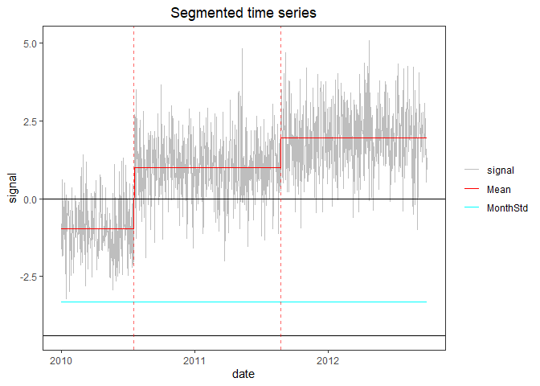
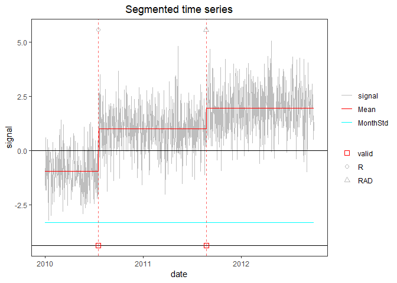

<!-- README.md is generated from README.Rmd. Please edit that file -->

# PMLseg

PMLseg is a R package for the segmentation of univariate time series
based on Penalized Maximum Likelihood. The method detects changes in the
mean signal in the presence of a periodic bias and variance changing
over prescribed intervals. A preliminary version was published under the
name `GNSSseg` which was developed for the detection of change-points in
daily GNSS minus reanalysis IWV time series with annual periodic bias
and variance changing on monthly intervals. PMLseg is more versatile and
can be used with various modelling options (with or without periodic
bias, constant or monthly varying noise) and algorithmic evolutions
regarding the iterative inference scheme. The time series should be
provided in a data frame containing two columns: date and signal. The
package includes the segmentation function as well as auxiliary
functions for the validation with metadata, cluster screening,
statistical test of change-points, and visualization of the time series
with segmentation and validation results. The theoretical basis of the
method can be found in (Quarello, Bock, and Lebarbier 2022).

## Table of Contents

-   [Installation](#installation)
-   [Functions](#functions)
-   [Examples](#examples)
-   [References](#references)

## Installation

The development version of `PMLseg` can be installed from GitHub with:

    # Install devtools, tidyr, and purrr if you haven't already
    install.packages("devtools", dependencies = TRUE))
    install.packages("tidyr", dependencies = TRUE))
    install.packages("purrr", dependencies = TRUE))

    # Download and install gfpop from
    https://cran.r-project.org/src/contrib/Archive/gfpop/gfpop_1.1.1.tar.gz
    install.packages("gfpop_1.1.1.tar.gz")

    # Install PMLseg from GitHub
    devtools::install_github("khanhninhnguyen/PMLSeg")

## Functions

The package contains the following functions:

    Segmentation: estimates the position of change-points in a time series

    Validation: finds the closest metadata events for each change-point

    Cluster_screening: detects clusters of change-points (based on a statistical test)

    Test_CP: tests significance of every change-point

    UpdateTimeSeries: removes data from the time-series in the clusters

    UpdatedParametersForFixedCP: removes change-points in the clusters

    PlotSeg: plots time series, change-points, metadata and validation results

Usage and help on functions can be found by ?“function” in R console,
e.g.

    ?Segmentation

## Examples

Below we provide an example of the main functions with a simulated time
series. More examples are given in the `Examples.md/` folder.

### Simulation of a time series with changes in the mean and homogeneous variance

    rm(list=ls(all=TRUE))
    library(PMLseg)
    library(purrr)

    # define simulation function
    simulate_time_series <- function(cp_ind, segmt_mean, noise_stdev, length_series) {
      time_series <- rep(0, length_series)
      jump_indices <- c(1, cp_ind+1, length_series + 1)
      offsets <- c(0, diff(segmt_mean))

      changes <- rep(0, length_series)
      changes[jump_indices[-length(jump_indices)]] <- offsets
      changes[1] <- segmt_mean[1]

      time_series <- cumsum(changes)
      noise <- rnorm(n = length_series, mean = 0, sd = noise_stdev)
      time_series <- time_series + noise

      return(time_series)
    }

    # specify the simulation parameters
    n <- 1000                    # length of time series
    cp_ind <- c(200, 600)       # position of CPs (index in time series)
    segmt_mean <- c(-1, 1, 2)   # mean value of segments
    noise_stdev <- 1             # noise std dev (identical for all months)
    set.seed(1)                 # initialise random generator

    # create a data frame of time series with 2 columns: date, signal
    mydate <- seq.Date(from = as.Date("2010-01-01"), to = as.Date("2010-01-01")+(n-1), by = "day")
    mysignal <- simulate_time_series(cp_ind, segmt_mean, noise_stdev, n)
    df <- data.frame(date = mydate, signal = mysignal)

### Segmentation

    seg = Segmentation(OneSeries = df, 
                       FunctPart = FALSE,
                       VarMonthly = FALSE)
    str(seg)
    #> List of 6
    #>  $ Tmu     :'data.frame':    3 obs. of  7 variables:
    #>   ..$ begin : int [1:3] 1 201 601
    #>   ..$ end   : int [1:3] 200 600 1000
    #>   ..$ tbegin: Date[1:3], format: "2010-01-01" "2010-07-20" ...
    #>   ..$ tend  : Date[1:3], format: "2010-07-19" "2011-08-23" ...
    #>   ..$ mean  : num [1:3] -0.964 0.999 1.954
    #>   ..$ se    : num [1:3] 0.0753 0.0533 0.0533
    #>   ..$ np    : int [1:3] 200 400 400
    #>  $ FitF    : logi FALSE
    #>  $ CoeffF  : logi FALSE
    #>  $ MonthVar: num 1.14
    #>  $ SSR     : num 941
    #>  $ SSR_All : num [1:30] 1941 1102 941 937 928 ...

The `Tmu` dataframe contains, for each segment: the index and date/time
of beginning and end, the estimated mean `mean` and its standard erreor
`se`, and the number of valid (non-NA) data points `np` in the signal:

    seg$Tmu
    #>   begin  end     tbegin       tend       mean         se  np
    #> 1     1  200 2010-01-01 2010-07-19 -0.9644604 0.07534822 200
    #> 2   201  600 2010-07-20 2011-08-23  0.9994054 0.05327923 400
    #> 3   601 1000 2011-08-24 2012-09-26  1.9537044 0.05327923 400

The time series with segmentation results superposed can be plotted with
the `PlotSeg` function:

    PlotSeg(OneSeries = df, 
            SegRes = seg, 
            FunctPart = FALSE)

The plot shows the signal (grey line), the estimated means (red line),
the estimated noise std (cyan line). The y-intercept of the noise is the
lower black line. Dashed vertical lines show the estimated times of the
change-points.

### Validation of detected change-points with metadata

Metadata is represented by a data frame with 2 columns: `date`, `type`.

For the example, we create a fake metadata data frame with the true
position of change-points:

    meta_ind = cp_ind               # index in time series of metadata information
    meta_date <- df$date[meta_ind]  # corresponding date 
    meta_type <- c("R", "RAD")      # type of information, e.g. R = receiver change, A = antenna change, D = radome change
    metadata = data.frame(date = meta_date, type = meta_type)
    metadata
    #>         date type
    #> 1 2010-07-19    R
    #> 2 2011-08-23  RAD

Validate estimated change-point positions wrt metadata:

    valid_max_dist = 10             # maximum distance wrt metadata for a CP to be validated
    valid = Validation(OneSeries = df, 
               Tmu = seg$Tmu,
               MaxDist =  valid_max_dist,
               Metadata = metadata)
    valid
    #>           CP closestMetadata type Distance valid
    #> 1 2010-07-19      2010-07-19    R        0     1
    #> 2 2011-08-23      2011-08-23  RAD        0     1

Note: valid$Distance gives the distance between estimated CP and
metadata

Plot with metadata and validation results:

    PlotSeg(OneSeries = df, SegRes = seg, FunctPart = FALSE, Metadata = metadata, Validated_CP_Meta = valid)

Metadata are indicated by grey symbols near the top of the figure.
Validated change-points are indicated by a red squares at the bottom of
the figure.

### Test the significance of the detected change-points

Our segmentation method is based on maximum likelihood. Other methods
use tests. Some users are more familiar with the concept of significance
provided by such methods. Since we have implemented a test in the
cluster screening function (see Example 3), we found it useful to
provide a test function which can be used in a post-segmentation step to
evaluate the significance of the detected change-points. In practice, it
comes out that the change-points detected by PMLseg are almost always
significant at the level 0.05.

    test <- Test_CP(Tmu = seg$Tmu, alpha = 0.05, detail = TRUE)
    test
    #> $UpdatedCP
    #> [1] 200 600
    #> 
    #> $ChangeCP
    #> [1] "No"
    #> 
    #> $detail
    #>         mu_L      mu_R       se_L       se_R np_L np_R     tstat          pval
    #> 1 -0.9644604 0.9994054 0.07534822 0.05327923  200  400 -21.28106 1.700634e-100
    #> 2  0.9994054 1.9537044 0.05327923 0.05327923  400  400 -12.66518  9.220540e-37
    #>   signif
    #> 1      1
    #> 2      1

The test structure provides the list of updated change-points
`UpdatedCP`, the variable `ChangeCP` indicates if the list has been
changed compared to the input vector `Tmu`. An optinal variable `detail`
is returned if the input option `detail` is TRUE. It provides the input
information on the pairs of segments to the left and to the right of
each change-point which have been used for the test, and the test
outputs, `tstat`, `pval`, and `signif`, where `signif` = 1 means that a
change-point is significant (this is the case when `pval < alpha`).

### Other examples

See the other examples with more complex signals in the `Examples.md/`
folder:

-   [Example 1: time series with 2 change-points and constant
    noise](./Examples.md/Example1.md)
-   [Example 2: time series with missing
    data](./Examples.md/Example2.md)
-   [Example 3: time series with clusters of
    CPs](./Examples.md/Example3.md)
-   [Example 4: time series with monthly varying
    variance](./Examples.md/Example4.md)
-   [Example 5: time series with periodic
    bias](./Examples.md/Example5.md)
-   [Example 6: time series with periodic bias, monthly variance, and
    gaps](./Examples.md/Example6.md)
-   [Example 7: Explore the different penalty
    criteria](./Examples.md/Example7.md)

See also the use cases with real data in the `Use_Cases/` folder:

-   [Use case 1: time series of daily IWV differences
    (GNSS-ERA5)](./Use_cases/use_case_1.md)

### Contribute

Contributions are welcome! Open an
[Issue](https://github.com/khanhninhnguyen/PMLSeg/issues) or Pull a
Request.

## References

Quarello, Annarosa, Olivier Bock, and Emilie Lebarbier. 2022. “GNSSseg,
a Statistical Method for the Segmentation of Daily GNSS IWV Time
Series.” *Remote Sensing* 14 (14): 3379.
<https://doi.org/10.3390/rs14143379>.
