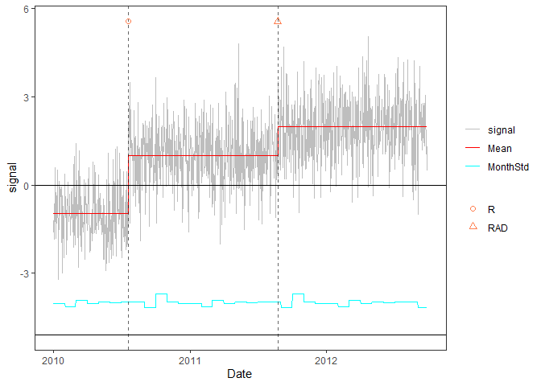
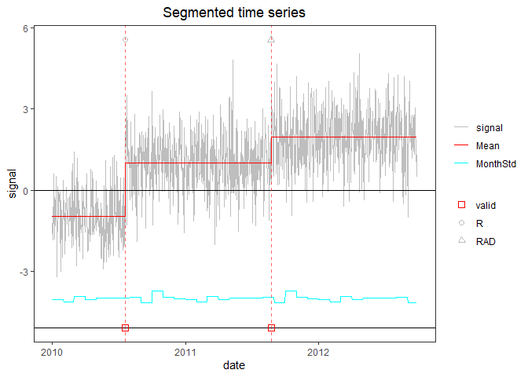

<!-- README.md is generated from README.Rmd. Please edit that file -->

# PMLSeg

PMLseg is a R package for the segmentation of univariate time series
based on Penalized Maximum Likelihood. The method detects changes in the
mean signal in the presence of a periodic bias and variance changing
over prescribed intervals. A preliminary version was published under the
name `GNSSseg` which was developed for the detection of change-points in
daily GNSS minus reanalysis IWV time series with annual periodic bias
and variance changing on monthly intervals. PMLseg is more versatile and
can be used with time series provided in a data frame containing two
columns (date and signal). The package includes the segmentation
function as well as auxiliary functions for the validation with
metadata, cluster screening, and visualization of the time series with
segmentation results. The theoretical basis of the method can be found
in (Quarello, Bock, and Lebarbier 2022).

## Table of Contents

-   [Installation](#installation)
-   [Functions](#functions)
-   [Examples](#examples)

## Installation

The development version of `PMLSeg` can be installed from GitHub with:

    # Install devtools, tidyr, and purr if you haven't already
    install.packages("devtools")
    install.packages("tidyr")
    install.packages("purr")

    # Download and install gfpop from
    https://cran.r-project.org/src/contrib/Archive/gfpop/gfpop_1.1.1.tar.gz
    install.packages("gfpop_1.1.1.tar.gz")

    # Install PMLseg from GitHub
    devtools::install_github("khanhninhnguyen/PMLSeg")

# Functions

The package contains the following functions:

    Segmentation(
      OneSeries,            # data frame, n x 2, $signal, $date in Date format
      lmin = 1,             # minimum length of the segments
      Kmax = 30,            # maximal number of segments
      selectionK = "BM_BJ", # penalty criterion used for the model selection
      FunctPart = TRUE,     # include the functional part in the model 
      selectionF = FALSE,   # select only significant coefficients in the functional
      initf="ascendent"     # initialization in the iterative inference procedure.
    )

    Validation(
      OneSeries,            # data frame, n x 2, $signal, $date in Date format
      Tmu,                  # segmentation results
      MaxDist = 62,         # maximum distance (in days) between detected CP in Tmu and known events in Metadata
      Metadata              # data frame with two columns: $date and the $type
    )

    Cluster_screening(
      Tmu,                  # segmentation results
      MaxDist = 80,         # maximal number of days between change-points within a cluster
      alpha = 0.05,         # significance level of test
      detail = FALSE        # if TRUE the output contains a $detail field with additional information on the test
    )

    UpdatedParametersForFixedCP(
      OneSeries,            # data frame, n x 2, $signal, $date in Date format
      ResScreening,         # output from Cluster_screening function
      FunctPart = TRUE,     # update functional part
      selectionF = FALSE,   # select only significant coefficients in the functional
    )

    PlotSeg(
      OneSeries,            # data frame, n x 2, $signal, $date in Date format
      SegRes,               # output from Segmentation function
      FunctPart = TRUE,     # plot functional
      RemoveData = NULL,    # remove screened data
      Metadata = NULL,      # plot metadata
      Validated_CP_Meta = NULL, # plot validation result
      labelx = "Date",
      labely = "signal"
    )

Usage and help on functions can be found by ?“function” in R console,
e.g.

    ?Segmentation

## Examples

Several examples are given in the `Examples.md/` folder. Below we
provide an excerpt of example1.md

### Simulation of a time series with changes in the mean and homogeneous variance

    rm(list=ls(all=TRUE))
    library(PMLseg)
    library(purrr)

    # define simulation function
    simulate_time_series <- function(cp_ind, segmt_mean, noise_stdev, length_series) {
      time_series <- rep(0, length_series)
      jump_indices <- c(1, cp_ind+1, length_series + 1)
      offsets <- c(0, diff(segmt_mean))

      changes <- rep(0, length_series)
      changes[jump_indices[-length(jump_indices)]] <- offsets
      changes[1] <- segmt_mean[1]

      time_series <- cumsum(changes)
      noise <- rnorm(n = length_series, mean = 0, sd = noise_stdev)
      time_series <- time_series + noise

      return(time_series)
    }

    # specify the simulation parameters
    n <- 1000                    # length of time series
    cp_ind <- c(200, 600)       # position of CPs (index in time series)
    segmt_mean <- c(-1, 1, 2)   # mean value of segments
    noise_stdev <- 1             # noise std dev (identical for all months)
    set.seed(1)                 # initialise random generator

    # create a data frame of time series with 2 columns: date, signal
    mydate <- seq.Date(from = as.Date("2010-01-01"), to = as.Date("2010-01-01")+(n-1), by = "day")
    mysignal <- simulate_time_series(cp_ind, segmt_mean, noise_stdev, n)
    df <- data.frame(date = mydate, signal = mysignal)

### Segmentation

    seg = Segmentation(OneSeries = df, 
                       FunctPart = FALSE)
    str(seg)
    #> List of 6
    #>  $ Tmu     :'data.frame':    3 obs. of  5 variables:
    #>   ..$ begin: int [1:3] 1 201 601
    #>   ..$ end  : int [1:3] 200 600 1000
    #>   ..$ mean : num [1:3] -0.959 0.999 1.97
    #>   ..$ se   : num [1:3] 0.075 0.0538 0.053
    #>   ..$ np   : int [1:3] 200 400 400
    #>  $ FitF    : logi FALSE
    #>  $ CoeffF  : logi FALSE
    #>  $ MonthVar: num [1:12] 1.089 0.887 1.334 1.092 1.21 ...
    #>  $ SSR     : num 926
    #>  $ SSR_All : num [1:30] 1943 1092 926 923 914 ...

The `Tmu` dataframe contains, for each segment: the index of beginning
and end, the esitmated mean and its standard erreor `se`, and the number
of valid (non-NA) data points `np` in the signal:

    seg$Tmu
    #>   begin  end       mean         se  np
    #> 1     1  200 -0.9590041 0.07503988 200
    #> 2   201  600  0.9986774 0.05381478 400
    #> 3   601 1000  1.9700134 0.05301899 400

The time series with segmentation results superposed can be plotted with
the `PlotSeg` function:

    PlotSeg(OneSeries = df, 
            SegRes = seg, 
            FunctPart = FALSE)

The plot shows the signal (grey line), the estimated means (red line),
the estimated noise std (cyan line). The y-intercept of the noise is the
lower black line. Dashed vertical lines show the estimated times of the
change-points.

### Validation of detected change-points with metadata

Metadata is represented by a data frame with 2 columns: `date`, `type`.

For the example, we create a fake metadata data frame with the true
position of change-points:

    meta_ind = cp_ind               # index in time series of metadata information
    meta_date <- df$date[meta_ind]  # corresponding date 
    meta_type <- c("R", "RAD")      # type of information, e.g. R = receiver change, A = antenna change, D = radome change
    metadata = data.frame(date = meta_date, type = meta_type)
    metadata
    #>         date type
    #> 1 2010-07-19    R
    #> 2 2011-08-23  RAD

Plot with metadata:

    PlotSeg(OneSeries = df, 
            SegRes = seg, 
            FunctPart = FALSE, 
            Metadata = metadata) 

Validate estimated change-point positions wrt metadata:

    valid_max_dist = 10             # maximum distance wrt metadata for a CP to be validated
    valid = Validation(OneSeries = df, 
               Tmu = seg$Tmu,
               MaxDist =  valid_max_dist,
               Metadata = metadata)
    valid
    #> # A tibble: 2 × 5
    #>   CP         closestMetadata Distance type  valid
    #>   <date>     <date>             <dbl> <chr> <dbl>
    #> 1 2010-07-19 2010-07-19             0 R         1
    #> 2 2011-08-23 2011-08-23             0 RAD       1

Note: valid$Distance gives the distance between estimated CP and
metadata

Plot with metadata and validation results:

    PlotSeg(OneSeries = df, SegRes = seg, FunctPart = FALSE, Metadata = metadata, Validated_CP_Meta = valid)

Validated change-points are indicated by a filled triangle at the bottom
line.

### Other examples

See the other examples with more complex signals in the `Examples.md/`
folder.

## References

Quarello, Annarosa, Olivier Bock, and Emilie Lebarbier. 2022. “GNSSseg,
a Statistical Method for the Segmentation of Daily GNSS IWV Time
Series.” *Remote Sensing* 14 (14): 3379.
<https://doi.org/10.3390/rs14143379>.
