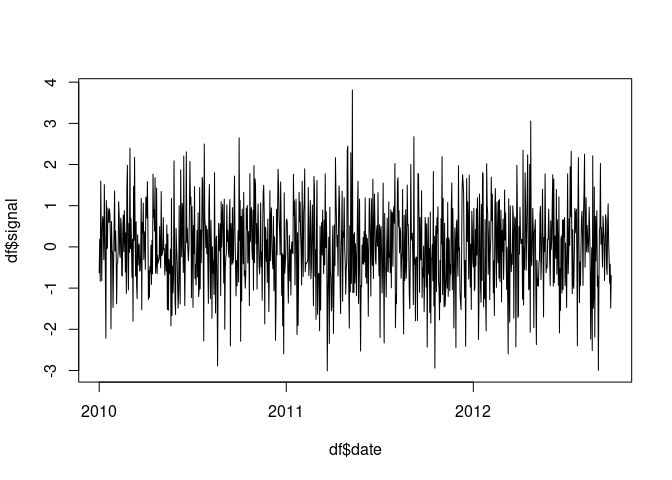
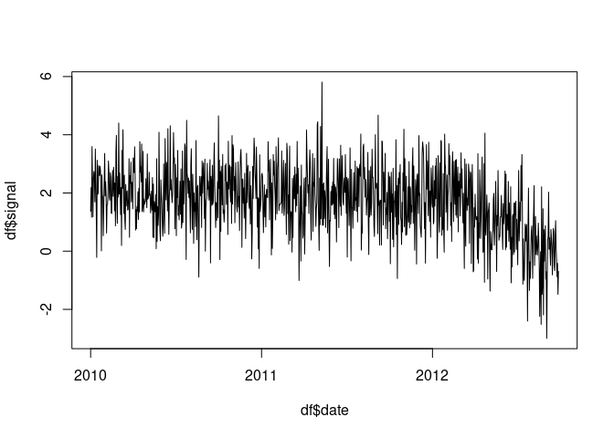
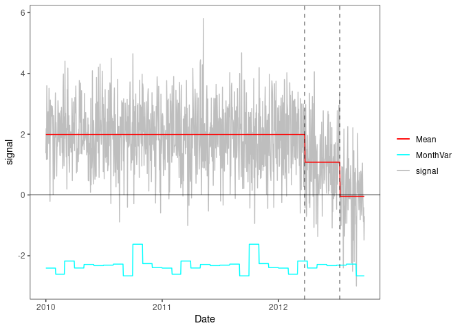

<!-- README.md is generated from README.Rmd. Please edit that file -->

# PMLSeg

This package used to detects change-points in daily climatic time series
modeled by piecewise mean, periodic bias, and monthly variance.
Additionally, it includes functions to validate and visualize the
segmentation results.

## Table of Contents

- [Installation](#installation)
- [Examples](#examples)

## Installation

You can install the development version of `PMLSeg` from GitHub with:

``` r

# Install devtools if you haven't already
install.packages("devtools")

# Install the package from GitHub
devtools::install_github("khanhninhnguyen/PMLSeg")
```

## Examples

1.  Creating a Time Series with Arbitrary Jumps

``` r
library(PMLseg)

set.seed(1)
length_series = 1000
df = data.frame(date = seq.Date(from = as.Date("2010-01-01"),
                                to = as.Date("2010-01-01")+(length_series-1), 
                                by = "day"),  
                signal = rnorm(n = length_series, mean = 0, sd = 1))
plot(df$date, df$signal, type = "l")
```



``` r
head(df, 3)
#>         date     signal
#> 1 2010-01-01 -0.6264538
#> 2 2010-01-02  0.1836433
#> 3 2010-01-03 -0.8356286
```

``` r
# Adding 2 jumps 
# Function to generate jump series
generate_jump_series <- function(jump_indices, jump_amp, length_series) {
  jump_series <- rep(0, length_series)
  jump_indices <- c(1, jump_indices, length_series + 1)
  
  changes <- rep(0, length_series)
  changes[jump_indices[-length(jump_indices)]] <- jump_amp
  
  jump_series <- cumsum(changes)
  
  return(jump_series)
}
# No cluster
jump_ind <- c(200, 600)
jump_amp <- c(0, 1, 1)
jump_series <- generate_jump_series(jump_ind, jump_amp, length_series)
df$signal <- df$signal + jump_series
plot(df$date, df$signal, type = "l")
```



2.  Segmenting the Time Series

Adjust the `FunctPart` parameter based on whether the series includes
seasonal mean components. This code run with default option for : `Kmax`
= 30 (maximum number of segments), `selectionK` = “BM_BJ” (recommended
penalized criterion), etc.

``` r
seg = Segmentation(OneSeries = df, 
                   FunctPart = FALSE)
str(seg)
#> List of 5
#>  $ Tmu     :'data.frame':    3 obs. of  5 variables:
#>   ..$ begin: int [1:3] 1 200 599
#>   ..$ end  : int [1:3] 199 598 1000
#>   ..$ mean : num [1:3] 0.0423 0.9973 1.969
#>   ..$ se   : num [1:3] 0.075 0.0536 0.0527
#>   ..$ np   : num [1:3] 199 399 402
#>  $ FitF    : logi FALSE
#>  $ CoeffF  : logi FALSE
#>  $ MonthVar: num [1:12] 1.089 0.887 1.334 1.092 1.21 ...
#>  $ SSR     : num 933
```

Main results: The beginning, end, mean value, standard deviation, and
number of points of segments are provided in the `Tmu` dataframe:

``` r
seg$Tmu
#>   begin  end       mean         se  np
#> 1     1  199 0.04231954 0.07503647 199
#> 2   200  598 0.99732352 0.05361806 399
#> 3   599 1000 1.96897996 0.05271989 402
```

3.  Visualizing Segmentation Results

``` r
PlotSeg(OneSeries = df, 
        SegRes = seg, 
        FunctPart = FALSE)
```



4.  Validating Detected Change-Points with Metadata

Change-points are validated if the segmentation finds them within
`MinDist` points from the metadata. Default `MinDist` is 62.

``` r
# Create a metadata for example 
meta = data.frame(date = df$date[jump_ind],  
                type = c("example1", "example2"))
meta
#>         date     type
#> 1 2010-07-19 example1
#> 2 2011-08-23 example2
```

``` r
# Validate the segmentation result wrt metadata 
Validation(OneSeries = df, 
           Tmu = seg$Tmu,
           MinDist = 30 ,
           Metadata = meta)
#> # A tibble: 2 × 5
#>   CP         closestMetadata Distance type     valid
#>   <date>     <date>             <dbl> <chr>    <dbl>
#> 1 2010-07-18 2010-07-19             1 example1     1
#> 2 2011-08-21 2011-08-23             2 example2     1
```

5.  Detecting Clusters of Change-Points

Check for clusters of close change-points, which may due to outliers. In
this example, there are no clusters of change-points, so
Cluster_Screening returns the same change-points as in the segmentation.

``` r
# Validate the segmentation result wrt metadata 
screening = Cluster_screening(Tmu = seg$Tmu,
                              MaxDist = 80)
screening
#> $UpdatedCP
#> [1] 199 598
#> 
#> $RemoveData
#>   begin end
#> 1    NA  NA
#> 
#> $ChangeCP
#> [1] "No"
```

If a cluster is detected, ClusterScreening indicates “Yes” to change the
vector of change-points. In such a situation, it is necessary to run the
UpdatedParametersForFixedCP function to re-estimate the mean with the
updated change-points. For more details, please refer to the test.pdf.
