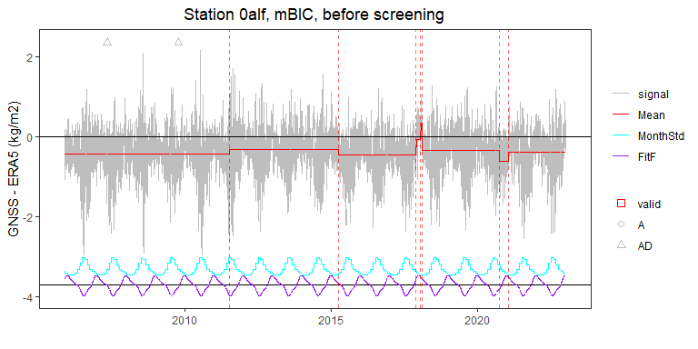
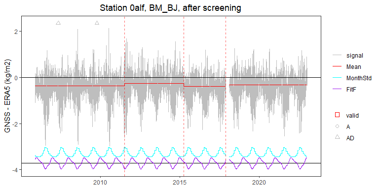
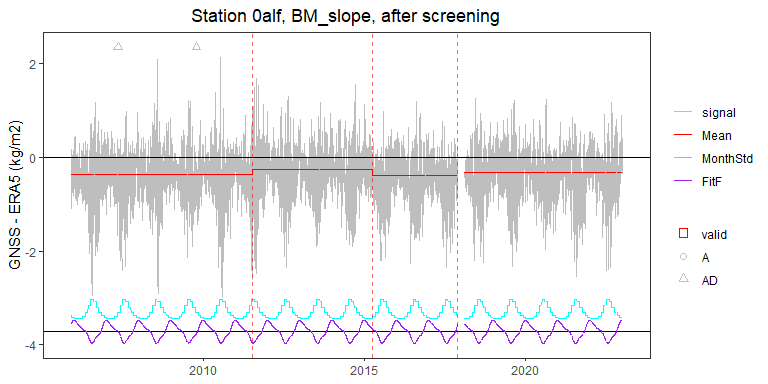

<!-- use_case_1.md is generated from use_case_1.Rmd. Please edit that file -->

## Use case \#1: time series of daily IWV differences (GNSS - ERA5)

    rm(list = ls())

    ### paths to data and metadata
    project = "use_case_1"
    path_data = "./data/"
    path_results = "./results/"
    path_plots = "./plots/"
    filename_metadata = "./metadata/metadata.txt"
    station_name = "0alf"
    # station_name = "clgo"
    mylabely = "GNSS - ERA5 (kg/m2)"

    ### Segmentation options
    selectionK = "All"
    #selectionK = "BM_BJ"
    selectionF = FALSE
    FunctPart = TRUE
    VarMonthly = TRUE
    Kmax = 30

    ### Validation options
    max_dist_validation = 62

    ### Screening options
    max_dist_cluster = 80
    alpha_cluster = 0.05

    ### Test options
    alpha_test_CP = 0.05

    source("./user_function.R")
    #> [1] "Load metadata file ./metadata/metadata.txt..."
    #> [1] " > found 3 metadata events for station 0alf"
    #>   name       date type
    #> 1 0alf 2005-11-15    A
    #> 2 0alf 2007-05-07   AD
    #> 3 0alf 2009-10-12   AD
    #> [1] "Load data file ./data/0alf.txt..."
    #> [1] " > data summary: n=6169, np=6169, dates=2005-11-21..2022-12-30 (6248 days), completeness=98.72%"
    #> [1] "Run segmentation for station 0alf with selectionK = All, selectionF = FALSE, FunctPart = TRUE, VarMonthly = TRUE, Kmax = 30 ..."
    #> [1] "Loop over selectionK:"
    #> [1] " > criterion = mBIC, station = 0alf, segmentation detected K = 8 segments, min(mu) = -0.62, max(mu) = 0.33, rms(MonthVar) = 0.44, rss(CoeffF) = 0.22, sqrt(SSR/dof) = 1.16"
    #> [1] " > criterion = mBIC, station = 0alf, validation of change-points: detected = 7, metadata = 3, validated = 0"
    #> [1] " > criterion = mBIC, station = 0alf, screening removed 1 segment(s)"
    #>         mu_L       mu_R       se_L       se_R np_L np_R     tstat         pval
    #> 1 -0.4488906 -0.3461712 0.01186658 0.01161417  962  947 -6.186291 6.159624e-10
    #>   signif
    #> 1      1
    #> [1] " > criterion = mBIC, station = 0alf, validation of change-points (after screening): detected = 5, metadata = 3, validated = 0"
    #> [1] " > criterion = mBIC, station = 0alf, test changed nothing"
    #> [1] " > criterion = mBIC, station = 0alf, validation of change-points (after screening and test): detected = 5, metadata = 3, validated = 0"
    #> Ignoring unknown labels:
    #> • fill : ""

    #> Ignoring unknown labels:
    #> • fill : ""

    #> Ignoring unknown labels:
    #> • fill : ""
    #> Ignoring unknown labels:
    #> • fill : ""
    #> Ignoring unknown labels:
    #> • fill : ""
    #> Ignoring unknown labels:
    #> • fill : ""

    #> [1] "Loop over selectionK:"
    #> [1] " > criterion = Lav, station = 0alf, segmentation detected K = 5 segments, min(mu) = -0.45, max(mu) = 0.02, rms(MonthVar) = 0.44, rss(CoeffF) = 0.21, sqrt(SSR/dof) = 1.17"
    #> [1] " > criterion = Lav, station = 0alf, validation of change-points: detected = 4, metadata = 3, validated = 0"
    #> [1] " > criterion = Lav, station = 0alf, screening removed 1 segment(s)"
    #>         mu_L       mu_R       se_L        se_R np_L np_R     tstat         pval
    #> 1 -0.4485439 -0.3846067 0.01186658 0.008452496  962 1762 -4.388537 1.141159e-05
    #>   signif
    #> 1      1
    #> [1] " > criterion = Lav, station = 0alf, validation of change-points (after screening): detected = 3, metadata = 3, validated = 0"
    #> [1] " > criterion = Lav, station = 0alf, test changed nothing"
    #> [1] " > criterion = Lav, station = 0alf, validation of change-points (after screening and test): detected = 3, metadata = 3, validated = 0"
    #> Ignoring unknown labels:
    #> • fill : ""

    #> Ignoring unknown labels:
    #> • fill : ""

    #> Ignoring unknown labels:
    #> • fill : ""
    #> Ignoring unknown labels:
    #> • fill : ""
    #> Ignoring unknown labels:
    #> • fill : ""
    #> Ignoring unknown labels:
    #> • fill : ""

    #> [1] "Loop over selectionK:"
    #> [1] " > criterion = BM_BJ, station = 0alf, segmentation detected K = 5 segments, min(mu) = -0.45, max(mu) = 0.02, rms(MonthVar) = 0.44, rss(CoeffF) = 0.21, sqrt(SSR/dof) = 1.17"
    #> [1] " > criterion = BM_BJ, station = 0alf, validation of change-points: detected = 4, metadata = 3, validated = 0"
    #> [1] " > criterion = BM_BJ, station = 0alf, screening removed 1 segment(s)"
    #>         mu_L       mu_R       se_L        se_R np_L np_R     tstat         pval
    #> 1 -0.4485439 -0.3846067 0.01186658 0.008452496  962 1762 -4.388537 1.141159e-05
    #>   signif
    #> 1      1
    #> [1] " > criterion = BM_BJ, station = 0alf, validation of change-points (after screening): detected = 3, metadata = 3, validated = 0"
    #> [1] " > criterion = BM_BJ, station = 0alf, test changed nothing"
    #> [1] " > criterion = BM_BJ, station = 0alf, validation of change-points (after screening and test): detected = 3, metadata = 3, validated = 0"
    #> Ignoring unknown labels:
    #> • fill : ""

    #> Ignoring unknown labels:
    #> • fill : ""

    #> Ignoring unknown labels:
    #> • fill : ""
    #> Ignoring unknown labels:
    #> • fill : ""
    #> Ignoring unknown labels:
    #> • fill : ""
    #> Ignoring unknown labels:
    #> • fill : ""

    #> [1] "Loop over selectionK:"
    #> [1] " > criterion = BM_slope, station = 0alf, segmentation detected K = 5 segments, min(mu) = -0.45, max(mu) = 0.02, rms(MonthVar) = 0.44, rss(CoeffF) = 0.21, sqrt(SSR/dof) = 1.17"
    #> [1] " > criterion = BM_slope, station = 0alf, validation of change-points: detected = 4, metadata = 3, validated = 0"
    #> [1] " > criterion = BM_slope, station = 0alf, screening removed 1 segment(s)"
    #>         mu_L       mu_R       se_L        se_R np_L np_R     tstat         pval
    #> 1 -0.4485439 -0.3846067 0.01186658 0.008452496  962 1762 -4.388537 1.141159e-05
    #>   signif
    #> 1      1
    #> [1] " > criterion = BM_slope, station = 0alf, validation of change-points (after screening): detected = 3, metadata = 3, validated = 0"
    #> [1] " > criterion = BM_slope, station = 0alf, test changed nothing"
    #> [1] " > criterion = BM_slope, station = 0alf, validation of change-points (after screening and test): detected = 3, metadata = 3, validated = 0"
    #> Ignoring unknown labels:
    #> • fill : ""

    #> Ignoring unknown labels:
    #> • fill : ""

    #> Ignoring unknown labels:
    #> • fill : ""
    #> Ignoring unknown labels:
    #> • fill : ""
    #> Ignoring unknown labels:
    #> • fill : ""
    #> Ignoring unknown labels:
    #> • fill : ""

