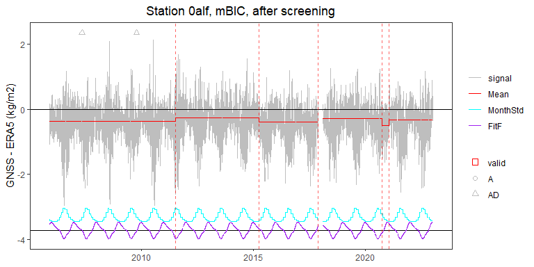

<!-- use_case_1.md is generated from use_case_1.Rmd. Please edit that file -->

## Use case \#1: time series of daily IWV differences (GNSS - ERA5)

### Load useful packages

    rm(list = ls())
    library(purrr)
    library(lubridate)
    library(dplyr)
    library(ggplot2)
    library(PMLseg)

    ### path to data and metadata: Ninh -> Hugo
    path_data = "./data/"
    path_result = "./results/"
    path_plots = "./plots/"
    filename_metadata = "./metadata/metadata.txt"
    station_name = "0alf"
    # station_name = "clgo"
    mylabely = "GNSS - ERA5 (kg/m2)"

    ### Segmentation options
    criterion = "BM_BJ"
    FunctPart = TRUE
    VarMonthly = TRUE

    ### create output path if it does not exist
    if (!dir.exists(path_result)) {
      dir.create(path_result)
    }
    if (!dir.exists(path_plots)) {
      dir.create(path_plots)
    }

    ### load Metadata
    print(sprintf("load metadata %s...", filename_metadata))
    #> [1] "load metadata ./metadata/metadata.txt..."
    buffer = read.table(file = filename_metadata, header = TRUE) %>% 
      setNames(c("name", "year", "doy", "date", "type")) %>% 
      mutate(date = as.Date(date, format = "%Y-%m-%d"))
    Metadata = buffer %>% select(all_of(c("name", "date", "type")))

    ### select metadata for the station
    station_metadata = Metadata %>% filter(name ==  station_name)
    print(sprintf("found %d metadata events for station %s", nrow(station_metadata), station_name))
    #> [1] "found 3 metadata events for station 0alf"
    print(station_metadata)
    #>   name       date type
    #> 1 0alf 2005-11-15    A
    #> 2 0alf 2007-05-07   AD
    #> 3 0alf 2009-10-12   AD

    ### load data for the station
    path_data_one <- paste0(path_data, station_name, ".txt")
    print(sprintf("load data %s...", path_data_one))
    #> [1] "load data ./data/0alf.txt..."
    buffer <- read.table(
        file = path_data_one,
        sep = "\t",
        header = TRUE,
        na.strings = NaN,
        colClasses = c("character", "numeric"),
        col.names = c("date", "signal")
      )
    buffer$date <- as.Date(buffer$date, format = "%Y-%m-%d")
    OneSeries = buffer %>% select(all_of(c("date", "signal")))

    ### data info
    n <- length(OneSeries$date)
    np <- sum(!is.na(OneSeries$signal))
    date_begin <- OneSeries$date[1]
    date_end <- OneSeries$date[n]
    days_diff <- as.numeric(difftime(date_end, date_begin, units = "days"))
    completeness <- np / (days_diff + 1) * 100
    print(sprintf("data summary: n=%d, np=%d, dates=%s..%s (%d days), completeness=%.2f%%", n, np, date_begin, date_end, days_diff, completeness))
    #> [1] "data summary: n=6169, np=6169, dates=2005-11-21..2022-12-30 (6248 days), completeness=98.72%"

    ### Run segmentation
    seg = Segmentation(OneSeries = OneSeries, selectionK = criterion, selectionF = FALSE, Kmax = 10)
    pp <- nrow(seg$Tmu)+length(seg$CoeffF)
    print(seg$Tmu)
    #>   begin  end     tbegin       tend       mean         se   np
    #> 1     1 6169 2005-11-21 2022-12-30 -0.3968582 0.00448372 6169
    print(sqrt(seg$MonthVar))
    #>  [1] 0.2659240 0.2646232 0.2659240 0.3128119 0.4050152 0.5473837 0.6854104
    #>  [8] 0.6386405 0.5004923 0.4066973 0.3426852 0.2972443
    print(sqrt(mean(seg$MonthVar)))
    #> [1] 0.4351538
    print(seg$SSR)
    #> [1] 8625.239

    print(sprintf("Segmentation: K=%d, min(mu)=%.2f, max(mu)=%.2f, rms(MonthVar)=%.2f, rss(CoeffF)=%.2f, sqrt(SSR/dof)=%.2f", length(seg$Tmu$begin), min(seg$Tmu$mean), max(seg$Tmu$mean), sqrt(mean(seg$MonthVar)), sqrt(sum(seg$CoeffF^2)), sqrt(seg$SSR/(np-pp))))
    #> [1] "Segmentation: K=1, min(mu)=-0.40, max(mu)=-0.40, rms(MonthVar)=0.44, rss(CoeffF)=0.22, sqrt(SSR/dof)=1.18"

    ### plot series with segmentation results
    #dev.new(width = 8, height = 4, units = "in", res = 300)
    mytitle <- paste0("Station ", station_name)
    p <- PlotSeg(OneSeries = OneSeries, SegRes = seg, FunctPart = TRUE, labelx = "", labely = mylabely, title = mytitle)
    print(p)

    ### run validation
    max_dist_validation = 62
    valid = Validation(OneSeries = OneSeries, Tmu = seg$Tmu, Metadata = station_metadata, MaxDist = max_dist_validation)
    #> [1] "no CP to validate"
    print(sprintf("Validation: CPs detected=%d, metadata=%d, validated=%d", nrow(seg$Tmu)-1, nrow(station_metadata), sum(valid$valid)))
    #> [1] "Validation: CPs detected=0, metadata=3, validated=0"

    ### plot with validation results
    #dev.new(width = 8, height = 4, units = "in", res = 300)
    p <- PlotSeg(OneSeries = OneSeries, SegRes = seg, FunctPart = TRUE, labelx = "", labely = mylabely, Metadata = station_metadata, Validated_CP_Meta = valid, title = mytitle)
    print(p)

    ### cluster screening
    screening <- Cluster_screening(Tmu = seg$Tmu, MaxDist = 80, alpha = 0.05, detail = TRUE)
    print(screening)
    #> $UpdatedCP
    #> NULL
    #> 
    #> $RemoveData
    #>   begin end
    #> 1    NA  NA
    #> 
    #> $ChangeCP
    #> [1] "No"
    #> 
    #> $detail
    #> [1] NA

    ### if some CPs have been removed
    if (screening$ChangeCP == "Yes"){
        print(sprintf("Screening: removed %d segment(s)", nrow(screening$RemoveData)))
        ### add tbegin and tend to RemoveData
        screening$RemoveData = screening$RemoveData %>% mutate(tbegin = OneSeries$date[screening$RemoveData$begin], tend = OneSeries$date[screening$RemoveData$end])

        ### update the time series
        OneSeries_updated <- UpdateTimeSeries(OneSeries, screening$RemoveData)

        ### update the segmentation parameters after screening
        seg_updated <- UpdatedParametersForFixedCP(OneSeriesUpd = OneSeries_updated, UpdatedCP = screening$UpdatedCP, FunctPart = TRUE)
        
        ### validate again
        validUpd = Validation(OneSeries = OneSeries_updated, Tmu = seg_updated$Tmu, Metadata = station_metadata, MaxDist = max_dist_validation)

        ### plot with validation results
        p <- PlotSeg(OneSeries = OneSeries_updated, SegRes = seg_updated, FunctPart = TRUE, labelx = NULL, labely = mylabely, Metadata = station_metadata, Validated_CP_Meta = validUpd, title = mytitle)
    } else {
        print(sprintf(" => screening %s, %s: nothing removed", station_name, criterion))
        OneSeries_updated <- OneSeries
        seg_updated <- seg
    }
    #> [1] " => screening 0alf, BM_BJ: nothing removed"

    ### save plot
    file_name = file.path(path_plots, paste0(station_name, ".png"))
    ggplot2::ggsave(file_name, plot = p, width = 8, height = 4, units = "in")
