<!-- use_case_2.md is generated from use_case_2.Rmd. Please edit that file -->

## Use case \#2: time series of daily ZTD differences (GNSS - ERA5)

    rm(list = ls())

    ### paths to data and metadata
    project = "use_case_2"
    path_data = "./data/"
    path_results = "./results/"
    path_plots = "./plots/"
    filename_metadata = "./metadata/metadata_IGSR3.txt"
    station_name = "guat"
    mylabely = "GNSS - ERA5 (m)"

    ### Segmentation options
    selectionK = "All"
    #selectionK = "BM_BJ"
    selectionF = FALSE
    FunctPart = TRUE
    VarMonthly = TRUE
    Kmax = 30

    ### Validation options
    max_dist_validation = 62

    ### Screening options
    max_dist_cluster = 80
    alpha_cluster = 0.05

    ### Test options
    alpha_test_CP = 0.05

    source("./user_function.R")
    #> [1] "Load metadata file ./metadata/metadata_IGSR3.txt..."
    #> [1] " > found 7 metadata events for station guat"
    #>   name       date    type
    #> 1 guat 2008-09-18   RSFCI
    #> 2 guat 2009-03-06       F
    #> 3 guat 2010-05-28       F
    #> 4 guat 2011-11-28 RFYAsDl
    #> 5 guat 2012-01-25       C
    #> 6 guat 2012-06-12       l
    #> 7 guat 2014-08-13      FI
    #> [1] "Load data file ./data/guat.txt..."
    #> [1] " > data summary: n=6792, np=6792, dates=2000-07-28..2020-12-19 (7449 days), completeness=91.17%"
    #> [1] "Run segmentation for station guat with selectionK = All, selectionF = FALSE, FunctPart = TRUE, VarMonthly = TRUE, Kmax = 30 ..."
    #> [1] "Loop over selectionK:"
    #> [1] " > criterion = mBIC, station = guat, segmentation detected K = 27 segments, min(mu) = -0.04, max(mu) = 0.03, rms(MonthVar) = 0.01, rss(CoeffF) = 0.00, sqrt(SSR/dof) = 1.20"
    #> [1] " > criterion = mBIC, station = guat, validation of change-points: detected = 26, metadata = 7, validated = 5"
    #> [1] " > criterion = mBIC, station = guat, screening removed 10 segment(s)"
    #>             mu_L          mu_R         se_L         se_R np_L np_R       tstat
    #> 1   0.0047974057  0.0029831997 0.0004319274 0.0004603218  229  210   2.8740587
    #> 2   0.0029831997  0.0027802460 0.0004603218 0.0006454020  210  124   0.2560148
    #> 3   0.0027802460  0.0047859102 0.0006454020 0.0004901758  124  174  -2.4747784
    #> 4   0.0047859102  0.0021725435 0.0004901758 0.0002731500  174  595   4.6572074
    #> 5   0.0021725435  0.0057350006 0.0002731500 0.0005608263  595  151  -5.7108186
    #> 6  -0.0012195563  0.0015330190 0.0005703521 0.0002300067  129  865  -4.4758530
    #> 7  -0.0158112037 -0.0209530689 0.0003366355 0.0004378829  394  248   9.3094616
    #> 8  -0.0141477416 -0.0182170042 0.0006537789 0.0003627813   91  336   5.4424616
    #> 9  -0.0182170042  0.0008175588 0.0003627813 0.0001296198  336 2666 -49.4093372
    #> 10  0.0008175588  0.0011062106 0.0001296198 0.0003647743 2666  337  -0.7456397
    #>            pval signif
    #> 1  4.052336e-03      1
    #> 2  7.979394e-01      0
    #> 3  1.333189e-02      1
    #> 4  3.205275e-06      1
    #> 5  1.124341e-08      1
    #> 6  7.610683e-06      1
    #> 7  1.284820e-20      1
    #> 8  5.254929e-08      1
    #> 9  0.000000e+00      1
    #> 10 4.558851e-01      0
    #> [1] " > criterion = mBIC, station = guat, validation of change-points (after screening): detected = 11, metadata = 7, validated = 3"
    #> [1] " > criterion = mBIC, station = guat, test changed nothing"
    #> [1] " > criterion = mBIC, station = guat, validation of change-points (after screening and test): detected = 11, metadata = 7, validated = 3"

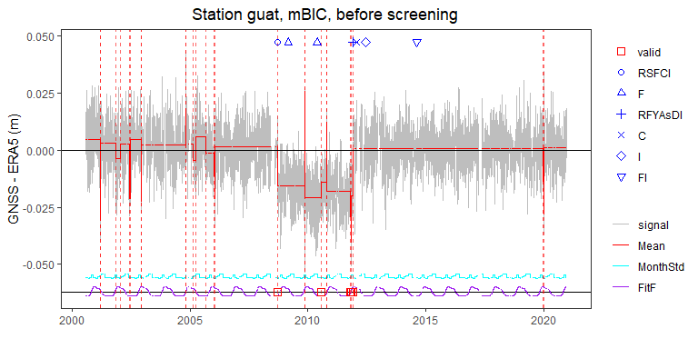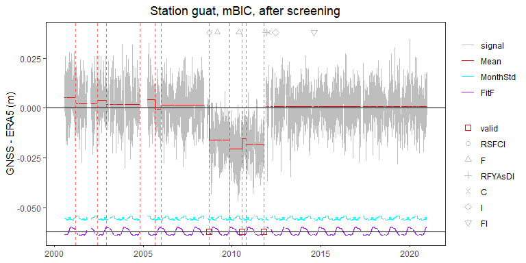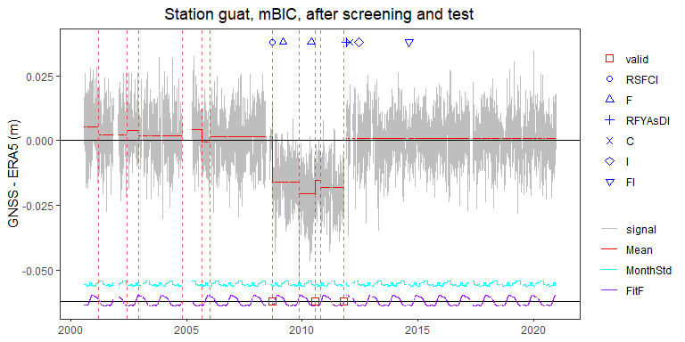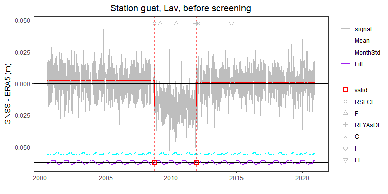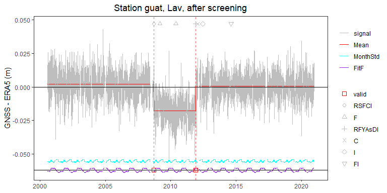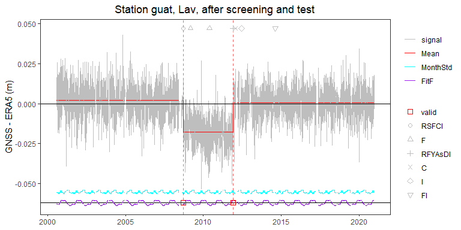

    #> [1] "Loop over selectionK:"
    #> [1] " > criterion = Lav, station = guat, segmentation detected K = 3 segments, min(mu) = -0.02, max(mu) = 0.00, rms(MonthVar) = 0.01, rss(CoeffF) = 0.00, sqrt(SSR/dof) = 1.24"
    #> [1] " > criterion = Lav, station = guat, validation of change-points: detected = 2, metadata = 7, validated = 2"
    #> [1] " > criterion = Lav, station = guat, screening removed nothing "
    #> [1] " > criterion = Lav, station = guat, validation of change-points (after screening): detected = 2, metadata = 7, validated = 2"
    #> [1] " > criterion = Lav, station = guat, test changed nothing"
    #> [1] " > criterion = Lav, station = guat, validation of change-points (after screening and test): detected = 2, metadata = 7, validated = 2"

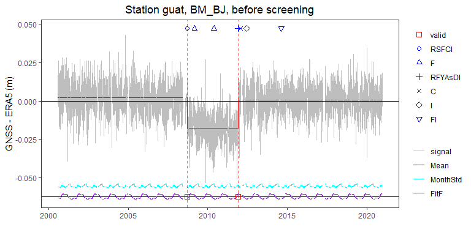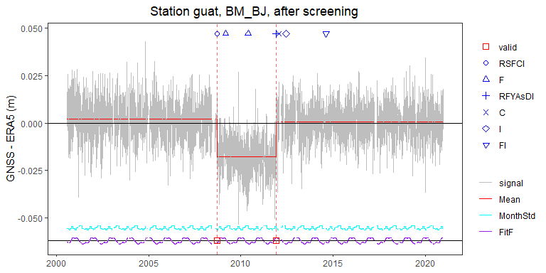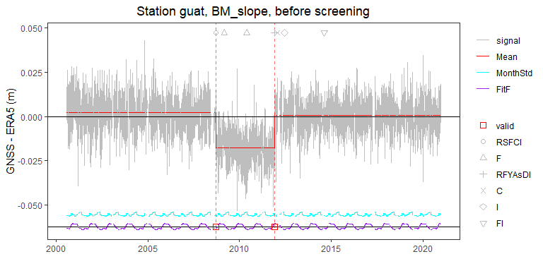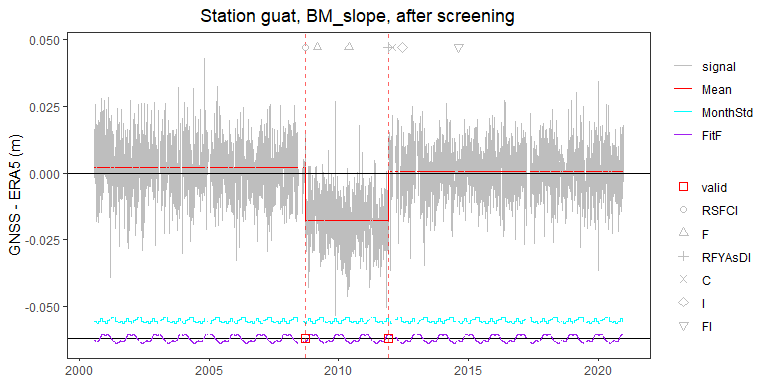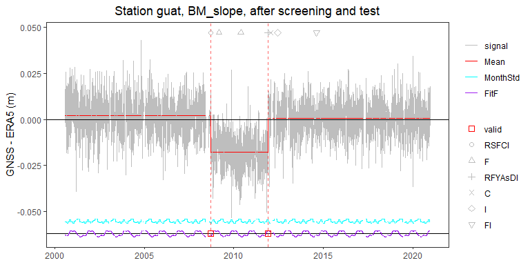

    #> [1] "Loop over selectionK:"
    #> [1] " > criterion = BM_BJ, station = guat, segmentation detected K = 3 segments, min(mu) = -0.02, max(mu) = 0.00, rms(MonthVar) = 0.01, rss(CoeffF) = 0.00, sqrt(SSR/dof) = 1.24"
    #> [1] " > criterion = BM_BJ, station = guat, validation of change-points: detected = 2, metadata = 7, validated = 2"
    #> [1] " > criterion = BM_BJ, station = guat, screening removed nothing "
    #> [1] " > criterion = BM_BJ, station = guat, validation of change-points (after screening): detected = 2, metadata = 7, validated = 2"
    #> [1] " > criterion = BM_BJ, station = guat, test changed nothing"
    #> [1] " > criterion = BM_BJ, station = guat, validation of change-points (after screening and test): detected = 2, metadata = 7, validated = 2"

    #> [1] "Loop over selectionK:"
    #> [1] " > criterion = BM_slope, station = guat, segmentation detected K = 3 segments, min(mu) = -0.02, max(mu) = 0.00, rms(MonthVar) = 0.01, rss(CoeffF) = 0.00, sqrt(SSR/dof) = 1.24"
    #> [1] " > criterion = BM_slope, station = guat, validation of change-points: detected = 2, metadata = 7, validated = 2"
    #> [1] " > criterion = BM_slope, station = guat, screening removed nothing "
    #> [1] " > criterion = BM_slope, station = guat, validation of change-points (after screening): detected = 2, metadata = 7, validated = 2"
    #> [1] " > criterion = BM_slope, station = guat, test changed nothing"
    #> [1] " > criterion = BM_slope, station = guat, validation of change-points (after screening and test): detected = 2, metadata = 7, validated = 2"

